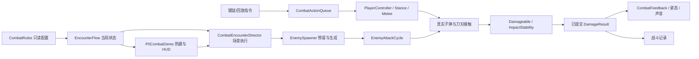

# Hades 本地脚本分析与机神底层重构

> 本页是 V3 时的分析与迁移决定，已归档。Hades 可读脚本证据仍可追溯；其中机神的压力 / Break / 处决适配、试场编排和旧验证结论已由 [Hades Rebuild V4](HADES_REBUILD_V4.md) 取代。

2026-09-17。输入为用户指定的 `D:/BaiduNetdiskDownload/Hades.Multi.9`。当前机神基线为 `Launcher/current.json` 指向的 CombatLoop_V2_Lab_20260916；不是旧 R9。修改前的全部游戏脚本、编辑器脚本、场景、配置、文档、构建工具、启动指针、Git 补丁与哈希在 `AuditEvidence/combat-foundation-v3`。

## 能从这份目录确认什么

这是包含可读 Lua / SJSON 的已构建游戏目录。有 Content/Scripts、Game、Maps、Win、Movies、Audio 及 x64/x86 二进制，未找到原生引擎的 C++ 工程或解决方案。Lua 调用的 FireWeaponFromUnit、CanAttack、SetAnimation 等原生 API 的底层实现不在此次可读源码内。因此本次分析覆盖玩法脚本和配置，不能声称已还原其物理、渲染、输入采样或完整引擎。

读取用户本地提供的代码作为参考。移植对象是职责划分与机制：为 Unity 编写本项目自己的 C# 实现；Hades 的 Lua、角色、地图、音乐、音效和贴图不进入 Demo 构建。下列参数采用现有机甲战斗的尺度与基线，不把 Hades 数字直接换算为米或秒。

## 代码证据与迁移决策

| 本地可核查位置 | 观察 | Unity 中的对应实现 |
| --- | --- | --- |
| Scripts/Main.lua:1–38，wait / waitScreenTime / waitUntil | 世界时间与屏幕时间分离；事件、协程及标签参与流程协调 | 动作请求使用模拟时间；暂停冻结；重开与取消清除同一行动的请求 |
| Game/Weapons/PlayerWeapons.sjson，RushWeapon 的 Effects 与 Cancelable；Scripts/WeaponData.lua | 武器和效果有独立数据，取消不是只关一个动画布尔值 | 动作请求队列、允许状态、时间窗口集中定义；冲刺、连斩、枪刀转换复用原碰撞和动画 |
| Scripts/Combat.lua:714 Damage、836 DamageEnemy | 集中处理有效性、加成、装甲/生命和致命结果，调用独立表现函数；部分通用表现仍在 HP 变化前调度 | 本次适配进一步明确 DamageResult；记录实际扣血与结算伤害；阻止死亡回调重入；表现消费提交后的结果 |
| Scripts/CombatPresentation.lua:1 起的预算，1453 DamagePresentation，2089 附近的 HitSimSlowParameters | 表现有单独职责、预算和命中停顿配置；不是每次碰撞无条件叠全套效果 | 将 Break / 处决的声光从 ImpactStability 数值计算移至反馈消费，保留现有容量上限与轻重层次 |
| Scripts/EnemyAI.lua:750 DoAttackerAILoop、1359 AttackOnce | 移动到位、预备、实际攻击、后续动作/恢复分段；中断和等待有归属 | 敌人攻击用明确的阶段和取消代号；预警失效后不得发射旧攻击；恢复窗口数据化 |
| Scripts/RunManager.lua:217 StartNewRun、745 ChooseEncounter、826 SetupEncounter | 当局状态重新创建；先筛选合法遭遇，再复制配置为运行实例 | 配置与运行状态分离；每次重开使用新 Run/Encounter 实例；不污染永久装备收藏 |
| Scripts/RoomManager.lua:2421 StartEncounter，3445/3475 开始/结束效果 | 进行、完成、清场反馈和解锁出口有顺序 | 遭遇编排独立于 HUD；活敌/预留出生、清场、吸收等待、Boss、结算使用明确状态 |
| Scripts/RunManager.lua:5590 KillMapThreads | 离开场景时统一中止该场景关联的工作 | 出生预留带 generation，取消归还计数；重开不遗留旧预警、迟到生成或旧 Boss 事件 |

这些是实际读到的脚本结构。对缺失的原生引擎内部不作推断性复刻。

### 动作与节奏

AttackOnce 中先停止移动、检查可攻击性，再转向并等待，之后才建立预备动画、声音和攻击警告。预备阶段可以选择跟踪目标；临近出手又检查强制中断、阶段结束和 CanAttack。实际出手不是“动画播到这里就一定打出伤害”。机神据此将 EnemyAttackCycle 的 Windup → Commit → Recovery 接入现有真实弹丸与近战，而取消会使该招的 generation 失效。

本次新增普通近战敌人 0.18 秒、普通远程敌人 0.22 秒的停步恢复，精英继续使用原来的 0.70 秒开放装甲。它们是本项目的试验数值，不是 Hades 参数。预警方向继续决定实际发射方向，恢复结束后才重新追踪/移动；已经发出的弹丸仍按原碰撞继续飞行。

Hades 的 RushWeapon 将无敌、力免疫、自身减速/速度变化等分成有时限、可取消的效果。机神仍使用原 CharacterController 位移、0.16 秒闪避无敌和原能量消耗，迁移重点是动作请求的期限、携带的方向与统一清理。CombatActionQueue 按 Dash / Slash / Combo / Support 保留有界请求；暂停、重开和夺取事务各自清除相应请求，短时间内未能找到目标的 E 支援也有 0.18 秒请求窗口。

### 命中表现

CombatPresentation.lua 的 DoWeaponHitSimulationSlow 读取武器的 HitSimSlowParameters / HitSimSlowCooldown，先检查是否已有时间变化、是否应对当前攻击者/受击者生效，再以屏幕时间调度速度变化；LastKillPresentation 还有单独的优先级、输入屏蔽和收尾。这里能读出“分级、限频、明确结束”的原则，无法由 Lua 还原原生渲染器。

机神的局部刀击停顿已由每段 Stroke 的 hitHold 和每刀一次上限实现，本次保留这条已通过 30/60/120 Hz 检查的姿态链。Break/处决声音、碎甲、震屏改由 CombatFeedback 消费 DamageResult；ImpactStability 只决定冲击、窗口、攻击中断与 Boss 露核。DamageResult 保存结算伤害、实际 HP 损失、过量伤害、接触与命中类型。失败的命中没有成功表现，致命状态先提交，再通知监听者，防止回调造成第二次击杀。

### 房间、遭遇与奖励

RoomEvents.lua 的 HandleEnemySpawns / HandleNextSpawn / CalculateActiveEnemyCap 将波次、可用出生点和活跃敌人上限共同考虑，不能简化成固定时间不断加怪。RunManager.ChooseRoomReward 先处理强制奖励、延后奖励和历史门奖励，再筛选资格；抽出的条目会从本局 RewardStore 中移除，耗尽后有补充与兜底。这是有约束的随机袋，而非每次独立随机。

机神当前固定试场更需要先保证六组敌群、Boss、清场与 F 夺取之间的顺序。因此现有六组 23 人编排移到 CombatRules.json，EncounterFlow 管理 Ready / Combat / Recovery / RewardHold / BossReady / Boss / BossDefeat / Victory / Defeat。CombatEncounterDirector 只负责把状态机输出变成场景操作，P0CombatDemo 负责热键、HUD 与结果显示。预留出生也占人数预算；取消预警归还预留并使旧 generation 无效。新开局创建新的运行实例，永久收藏仍由 EquipmentLoop 保存。

Hades 的神祇奖励袋、多生物群系选门、剧情资格和长线货币没有直接对应当前固定机甲试场的设计要求，本轮迁移采用现有装备掉落与吸收规则。若以后设计需要随机路线/构筑选择，可在这个遭遇接口上增加定义，无须再把所有分支塞回 HUD 脚本。

### 数据与运行状态

RunData.lua 的 SetupRunData / ProcessDataInheritance 为大量表处理继承；SetupEncounter 会复制配置后才生成运行中的遭遇。机神当前配置体量不需要动态 Lua 继承。CombatRules 使用 JSON 定义、版本与预算验证，再复制成只读运行值；任何一局的计时、已刷人数、Boss 死亡或输入请求都不写回定义。表中 C# 枚举、不可变结果和取消代号是此次 Unity 适配设计。

## 当前工程的实际接缝

1. 冲刺缓冲在 PlayerController、拔刀缓冲在 PlayerWeaponStance、连斩缓冲在 PlayerMeleeController；过期、暂停与取消规则分别维护。冲刺缓冲还使用消费帧的移动输入，短按后松手会丢掉原方向。
2. Damageable 先触发 OnDamaged，之后才 Kill。致命回调中仍可再次伤害同一对象；DamageInfo 可变，复用后会污染 LastHit。没有独立、不可变的实际 HP 损失结果。
3. ImpactStability.Resolve 在算伤害时直接发出处决特效与声音，PublishBreak 又直接混合中断、镜头和声音。表现与结算无法独立核对。
4. P0CombatDemo 同时包含两套刷怪推进、Boss 清理、输入热键、重开、统计和 HUD；遭遇配置散在数组、常量和分支里。
5. EnemySpawner 预留 EnemiesAlive 后开协程，CancelPendingSpawns 只停止协程。单独取消时没有归还预留计数；重开虽由 StopStage 清零掩盖问题，组件自身不完整。

## 实施与验收

沿用固定机甲、枪压冲击/抓窗口接刀、F 夺取与永久武器收藏。先重构动作请求、结算/反馈、敌人阶段和遭遇生命周期，保持原场地、模型、碰撞与输入方式。配置迁移保持现有已记录数值，另针对发现的缓冲方向、重入与取消问题增加行为验证。

需要独立 Windows 构建、新基础检查及原有实际 Player 回归；通过后才发布到同一桌面入口，保留旧构建。技术验证与玩家认可分开，完成记录追加在本文末尾。
