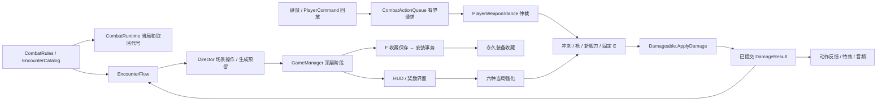

# 机神试炼 · Hades Rebuild V4 交付说明

2026-09-18。完成用户批准的 13 个模块，目标是枪和刀独立成立、组合有收益，并打通已有 Demo 的完整流程。开发基线为 D 盘 `handoff/GameplayLoop_V1` 的 V3 实际工作树，分支 `codex/equipment-loop-v1`，Git HEAD `e941bfb`；修改前的未提交 / 未跟踪内容均已冻结。没有把此前的 Git 提交当作干净基线覆盖用户工作。

## 试玩入口与规则

沿用桌面唯一的“机神试炼”入口，通过 `Launcher/launch.ps1` 和 `Launcher/current.json` 解析当前发布。候选为 `Builds/HadesRebuild_V4_M13/MECH_TRIAL_P0.exe`，发布时启动参数是 `-fullDemo -sliceView C`。进入机库后可选“完整流程”或“零强化试场”。各模块的独立构建 M01–M13 以及原 V3 构建均保留；中间构建用于回看实施过程，正常体验使用 M13。

鼠标手动瞄准，左键枪、右键 / Q 刀、Space 冲刺 / 长按推进、E 固定导弹支援、F 夺取。清场后可完成 F 安装，也可 Enter / 点击继续，仅收藏新枪；三选一之后才进入下一场。Esc 暂停，失焦暂停。失败后 R 立即重新出击，永久收藏保留、当局强化清空。试场按 Backspace 回机库；F9 为 30 秒表现实验，1 / 2 / 3 分别是基础反馈、完整反馈、关闭震屏，伤害规则一致。

普通敌人只承受生命伤害。重装敌人的有限护甲先承受整次伤害，破甲当击不溢出生命；护甲不回复，破甲解除对应抗硬直。没有通用压力条、枪破防前置或普通敌人强制斩杀。Boss 保留液态形态、既有攻击和两阶段，以攻击恢复期露核，枪刀均可输出。

## Hades 依据的边界

参考为用户指定的 `D:/BaiduNetdiskDownload/Hades.Multi.9`。完整拆解已记录 100 个 Lua、290 个 SJSON、144 个地图及匹配 PDB 元数据。这是发行目录里可读的玩法脚本 / 配置与符号材料，没有完整原生 C++ 工程。以下只采用能由这些文件证实的职责、阶段、数据生命周期与机制；缺失的原生输入、物理或渲染算法不作为还原结论。

所有游戏实现为本项目 C#。Hades 的脚本、地图、美术、音乐和音效未加入 Unity 构建。动作数值沿用机甲现有参数和本轮固定场景调校；F 夺枪、具体六场编排、强化百分比等是本项目设计，不声称 Hades 原样拥有。下表的 E 编号对应先前拆解的 `论证入口.json`，本交付亦保存索引供追溯。

## 逐模块改动与固定场景对照

“旧行为”来自修改前冻结的实际代码及历史验证；“新行为”由本轮固定夹具 / 实际 Player 验证。不是同输入、同随机事件的双版本性能竞赛，也不是用测试数量评价爽感。每个模块的构建、程序集指纹、检查报告和截图位置见 `AuditEvidence/hades-rebuild-v4/module-artifacts/module-index.json`。

| 模块 | 冻结基线 → 当前实现 | Hades 可核查依据 | 固定场景 / 对应检查 |
| --- | --- | --- | --- |
| 01 配置、状态、生命周期 | 散落模式状态 → CombatRuntime 的当局 / 动作代号；配置只读，收藏与当局分离；暂停 / 死亡 / 重开统一取消 | E03 `Main.lua:1,20,28`；E04 `RunManager.lua:5590`；E05 `RunData.lua:59,477`；E06 `RunManager.lua:217` | 按住动作暂停、旧代号回调、生成中重开、连续三次死亡重开；旧子弹与预留清空 |
| 02 镜头 | 普通 / Boss 控制和视野条件分散 → 共享 C 档 11.25，前瞻最多 1.25 m，震动幅度 / 时长上限，Boss 缩放 11.25–13.5；按视口边界约束 | E41 `RoomPresentation.lua:1`、`RoomManager.lua:1532` | 中央四方向冲刺落点、四边横移、贴角、Boss、暂停；普通命中不拉近 |
| 03 输入、机动 | 单组件缓存 → 统一 PlayerCommand 身份、时间、方向、取消代号；阻塞先检查，冲刺方向取按下快照；共享键鼠 / 回放路径 | E17 `Game/Weapons/PlayerWeapons.sjson:6` 的 RushWeapon 效果与取消定义；不推断原生输入缓冲算法 | 30 / 60 / 120 FPS 冲刺积分；过期请求、同帧优先、贴墙滑动、反向退出、失焦清缓存 |
| 04 武器、取消 | 枪刀共存依赖试场特例 → 全流程同时携带，PlayerWeaponStance 仲裁，P0ComboProfile 定义阶段；动画 / 刀路 / 音效读同一进度 | E18 `PlayerWeapons.sjson:1622,1828,1949` 的独立连段；E38 `Combat.lua:2242,2278` | 枪→刀→冲刺→枪；连段只缓存下一段；起手 / 有效帧 / 收招取消后无幽灵刀、补发子弹和迟到声 |
| 05 伤害、护甲 | 通用压力和普通敌人强制处决 → ArmorHealth 有限护甲；Damageable.ApplyDamage 唯一结算；DamageResult 分开生命 / 护甲 / 破甲 / 硬直 / 击杀 / 接触 | E21 `Combat.lua:714,836`；E22 `Combat.lua:1050,1088,1096` | 护甲 1 点承受大伤害时生命不变；护甲只伤也有效；普通敌人实际 1–2 刀；同回调递归 / 重复致命只有一次结算 |
| 06 AI 公平性 | 被击中 / 死亡后部分动作仍可能留存 → EnemyAttackCycle 分前摇、锁定、发射、恢复；可打断时撤销未发攻击，已发弹体继续；枪硬直有再触发间隔 | E14 `EnemyAI.lua:750,1017,1359,4460` | 前摇末端横移、破甲中断、死亡帧发射、连续步枪命中、墙与弹丸；不能永久定住所有敌人 |
| 07 受击表现 | 压力数值夹带表现 / 全局爆发 → 真实提交结果驱动局部火花、切痕、击退、碎甲、死亡；一刀多目标只触发一次刀击停顿 | E39 `CombatPresentation.lua:2067,2119,2156`；E40 同文件 `1,26,46` | 空挥、仅伤护甲、破甲、死亡、最后一击；240 Hz 刀路采样覆盖 100 / 180 / 320 ms 长帧；并发上限与远景可读性 |
| 08 音频 | 试场 / 正式流程触发分歧与重复换握 → 共用 R9 音库、动作阶段与真实接触事件；32 常规声部及步枪专用声部；取消 / 暂停 / 重开清理 | E38 开火表现；E40 表现预算；E43 `AudioScripts.lua:242,273,318` 的音频事件组织；不声称还原其原生混音器 | 原生 Player 事件录音、连续混战、推进循环、暂停 / 取消 / 重开；数值峰值和实际声音波形；人耳音色另验收 |
| 09 F 夺取 | 试场专属演出 / 自动收取时机 → 正式第二场 E-01，牵引→接住→锁定→启动；先存所有权，安装完成才替换当前枪 | E28 `UpgradeChoice.lua:628,666,695` 确认与替换；E30 `TraitScripts.lua:341,825` 应用 / 移除生命周期；F 演出为本项目实现 | 各阶段取消、死亡、存储失败 / 重试、隔墙、装上后实际开火；取消保留旧枪和已收藏所有权 |
| 10 遭遇、全流程 | 试场 Director 与六场各自决定推进 → 共用 EncounterFlow；Director 做生成 / 场景，StageManager 数活敌和预留，GameManager 管大阶段 | E08 `RoomManager.lua:2421,3655`；E13 `RoomEvents.lua:399,699,734` | 取消生成、最后敌人死亡、F 保留 / 明确继续、奖励一次、六场→Boss；合同测试注入击杀，另有普通输入完整通关 |
| 11 强化 | 偏射击的旧八种 → 刀距 / 刀速 / 射速 / 贯穿 / 推进效率 / E 回转；每场三选一、各最多三级；按基础值加算，换枪不反复乘属性 | E26 `RunManager.lua:1507,1516,1543` 资格；E28 `UpgradeChoice.lua:628`；E30 `TraitScripts.lua:573,825,1164` 生命周期 | 六次选择、重复卡回调、候选去重 / 满级剔除、真实刀长 / 动作速度、换枪重算、死亡清空；旧收藏不含当局强化 |
| 12 Boss | 共享 Break 暴露核心 → 既有招式恢复期露核，两阶段在动作边界切换；死亡后清攻击、增援与弹丸，胜利终态受保护 | E15 `EnemyAI.lua:4207`、`RoomEvents.lua:1843`；E14 攻击承诺 | 30 / 60 / 120 FPS 的散射 / 迫击 / 冲锋锁定与恢复；枪刀都受益；阶段边界；击杀后计时 / 残弹不能撤销胜利 |
| 13 UI、存档、入口 | 试场默认入口与 Break 提示 → 正式机库默认 M7+刀，短试场明确入口；耐久 / 能量 / 武器 / E / 目标；结果立即重玩 | E09 `DeathLoop.lua:47,322`；E44 `Main.lua:976,1008`；E45 `UIScripts.lua:1` | 真实 UI 按钮回调、旧 v1 收藏读取、损坏主存档回退、三次重开、永久文件哈希、桌面启动脚本验证 |

## 共用数据流

定义不被当局计时 / 血量 / 属性写回。伤害结果先提交死亡，再通知表现监听者，防止递归回调重复击杀。普通射击不触发持续全局停顿；刀击停顿局限于这一刀并去重。旧 ImpactStability 留作已序列化组件的无效果适配，旧枚举不再进入强化候选或实际压力计算。

动作请求按冲刺 > 近战 > 主射击处理，过期 / 旧取消代号的请求丢弃。冲刺方向使用按下时方向，键鼠与脚本均调用 PlayerController.Simulate。试场和正式流程共用 PrepareRun 及 run seed；F9 的表现开关不改变武器 / AI / 伤害规则。

## 编排与调校

正式顺序为：基础接敌 → 首次夺取 → 混合战 → 侧向机动 → 成长验证 → 综合战 → 液态 Boss。前三场维修区，后三场反应堆区。先前过短的普通输入通关暴露出单场只有约 23–34 秒；本轮保留敌人基础生命 / 伤害，通过增加既有敌群的编排完成 45–75 秒目标。未加定时等候或故意堆血。第一场 17 组，其余各 16 组，355 个普通阶段敌人；最多 7 个活敌加预留出生。高效击杀会提前进入下一组。

零强化短试场为现有六组角色组合的三个轮次，共 18 组 / 69 人。基础 M7、固定刀、零强化测试分别只发枪、只发刀和混合输入；不使用 E、临时无敌、测试补血、强制击杀或压制生成。混合打法可用射击处理接近 / 远处威胁，再近战连续击破；收益不靠额外隐藏易伤或处决倍率。

强化每级：刀长 +10%，挥刀速度 +8%，射速 +10%，穿透目标 +1，冲刺 / 推进能耗 -10%，E 冷却 -10%，各最多三级。基础动作 / 武器值统一重算；不修改永久收藏记录。

## 验证方法与证据

最终发布 `HadesRebuild_V4_M13`，2026-09-18 00:24:05（UTC+8）更新原入口。构建 0 错误 / 0 警告，146 个文件合计 615,276,050 字节。21 组同一程序集实际 Player 检查共 1611 项 PASS，全部退出 0。发布后又通过桌面脚本相同启动路径的静默音频检查。程序集 SHA-256：`5e013f6dbbef00e3ea278c90e432472bfdb41f255b6bf1d97f25c8c59c699cd7`。

| 基础装备、零强化 | 清场时间 | 击破 / 总敌人 | 剩余耐久 | 实际输入限制 |
| --- | ---: | ---: | ---: | --- |
| 纯枪 | 86.90 秒 | 69 / 69 | 176.69 / 180 | 355 次开火、0 次刀接触、无 E |
| 纯刀 | 61.83 秒 | 69 / 69 | 156.80 / 180 | 0 次开火、114 次有效刀接触、无 E |
| 混合 | 60.82 秒 | 69 / 69 | 158.45 / 180 | 103 次开火、78 次有效刀接触、无 E |

完整流程的固定输入通关为 **402.67 秒（6 分 43 秒）**：E-01 已安装、六次强化、363 次击破（含 Boss 及其增援）、剩余耐久 102.10、过程最低 18.44。六场战斗分别为 **46.45 / 52.62 / 58.35 / 55.00 / 60.22 / 64.75 秒**，Boss 为 **56.60 秒**。脚本选择与路线较快，不能将其表述为首次真人已达到 8–12 分钟；也未为凑时长加入等待。另一个原有移动策略的回放 84.73 秒完成 69 人短战斗，2542 帧 C 档远景可回看。

连续混合战斗原生立体声 48 kHz / 16 bit，60.80 秒，峰值 **0.42648**、RMS **-27.21 dBFS**、削波样本 **0**。原生事件音库、固定接触近 / 远景和另一策略回放共另外三份混音，均无削波。这证明录音和混音余量，音色满意度未由此确认。

Unity `6000.3.18f1` StrictMode Windows x64 构建。`tools/p0/run_rebuild.py` 启动隐藏、隔离存档的实际 Player；每组记录命令、退出码、程序集 SHA-256、日志及断言。固定种子为 9172026。发布所需最新报告必须全部通过并与待发布程序集一致，不能挑旧通过报告掩盖新失败。

检查分两种，结果不可混用：

1. 合同 / 边界检查主动构造护甲、长帧、取消、死亡、保存失败等场景；六场流程合同检查会注入击杀，只证明流程契约。
2. `playmix` 和 `fullplay` 用生产 PlayerCommand、实际枪弹 / 刀路 / 伤害与 AI 完成战斗；回放控制器知道目标位置、使用 NavMesh 规划绕障，不能视为真人反应或难度评测。完整流程允许设计内的波次 / 战区维修、E 和已选择强化，没有额外测试治疗或保护。

原生混音使用 Unity AudioRenderer 离线捕获，开始捕获后才恢复监听音量，停止前重新静音；测试没有通过扬声器播放。数值无削波不代表音色满意。截图由实际相机及生产 Canvas 离屏渲染，不是物理桌面画面或输入到显示延迟测量。

最终摘要自动保存在 `AuditEvidence/hades-rebuild-v4/release/test-summary.json`，自然战斗读数见同目录的 `playmix-*`、`fullplay-*`，全体检查和源码变化的哈希可单独查验。近 / 远景同帧接触对照见 `detail-*`；它使用静止的生产敌人、真实子弹和刀路，用于检查表现，不用于难度结论。旧的强制 Break / 处决和普通试场倒计时失败预期已更新；生命周期、碰撞、存档、声音和旧地形移动探针继续执行。

尚未完成的体验验收：真人确认基础装备 60–90 秒值得反复玩；真人首次完整体验是否约 8–12 分钟；耳机 / 扬声器实际听感；物理输入到显示延迟。它们与已实现的功能和实际 Player 检查分别报告，不以通过数量代替。

## 保全、回退与复现

修改前 `before-v4-source.zip` 含 2038 个文件，覆盖全部 Assets / ProjectSettings / Packages / docs / tools / Launcher 与根说明，包含原有未提交内容。`baseline.json` 保存每文件 SHA-256、原发布指针和永久收藏哈希；原 Git 状态 / 补丁也保留。冻结包不会覆盖。最终源包、逐文件差异与补丁以这个实际工作树为比较基线，避免把用户以前的改动算成本轮。

所有构建在 `Builds/HadesRebuild_V4_M01` 至 `M13`；旧 V3 等目录保留。`module-artifacts` 保存各构建指纹与阶段证据。最终 `release/build-manifest.json` 覆盖候选构建全部文件，发布工具核对集合、大小、SHA-256 和必需最新实际 Player 报告，再备份旧指针并原子写入 `Launcher/current.json`。唯一桌面快捷方式不更换目标。

复现：`python tools/p0/run_rebuild.py build 13`；随后用 `check / regression / foundation / rhythm / contact / impact / gun / break / absorption / loop / tactics / lab / audio / sound / flow / terrain / slice / detail / replay / playmix / fullplay` 替换 build。测试使用隔离 profile，不覆盖 `Launcher/UserData/profile.json`。重建会改变程序集指纹，必须重新验证该构建后才能发布。

本轮不扩随机地图、神系祝福、长期属性树、新机体或新 Boss。机体、原有美术资源、手动瞄准、固定背包及收藏 ID 保留。最终资源保全结果、源码变化和桌面入口 readback 写入发布交接摘要。
