# Hero Action Evidence

These are historical hero-only captures. Current playable slash damage and continuous action screenshots are documented in [MANUAL_COMBAT_HANDOFF.md](MANUAL_COMBAT_HANDOFF.md), under `audit-evidence/2026-09-05/manual-01/`.

Captured from the running Unity scene in Play Mode, not Blender renders. Closeups use a diagnostic camera; the gameplay camera is unchanged. Click an image for its full-size PNG. Complete pose samples and checks: [report](audit-evidence/2026-09-05/hero-01/report.txt).

## Model

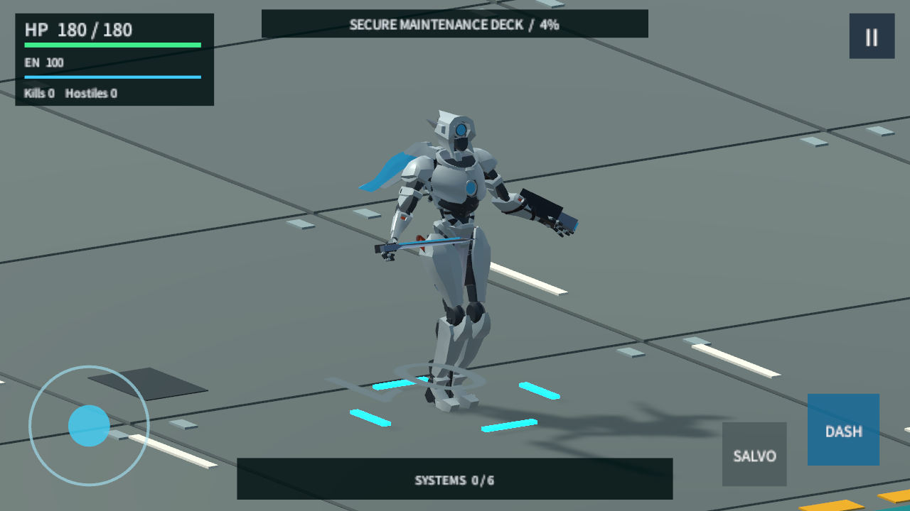

## Locomotion

| Idle | Run, first step | Run, other step | Dash |
| --- | --- | --- | --- |
|  | 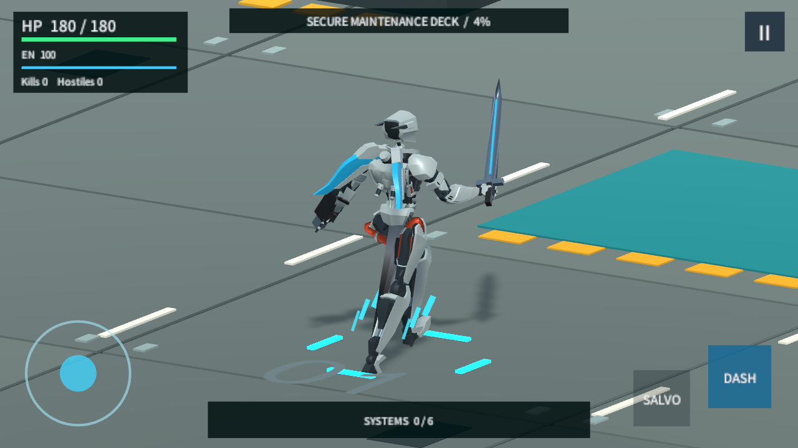 | 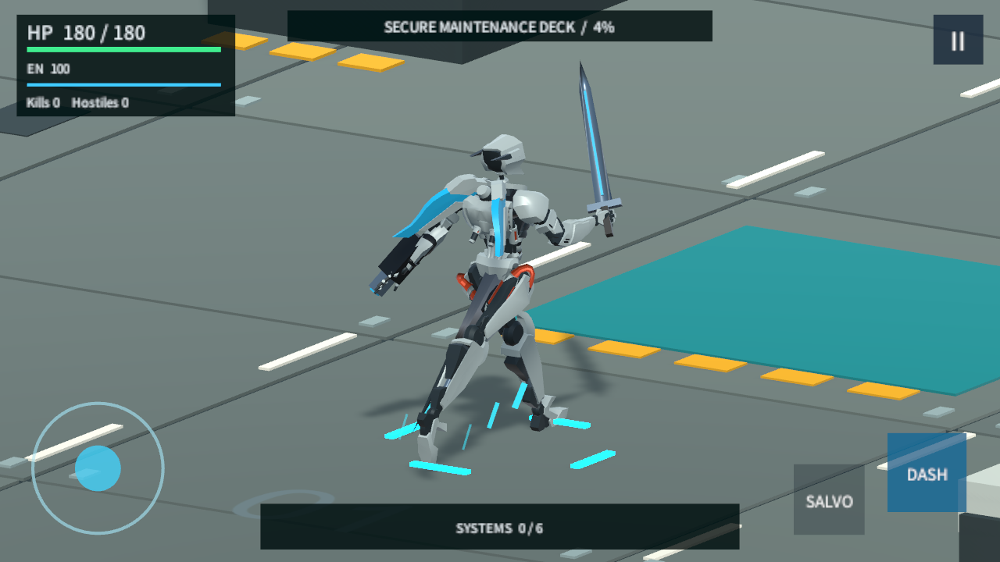 | 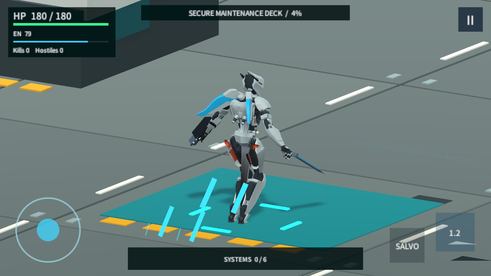 |

## Slash: Animation Diagnostic Only

The right arm and body genuinely animate and the blade follows the hand. **This is not a playable melee/combo test:** this checkout has no player melee damage or combo event. The diagnostic calls `PreviewSlash()`, without dealing damage.

| Windup | Slash | Follow-through |
| --- | --- | --- |
| 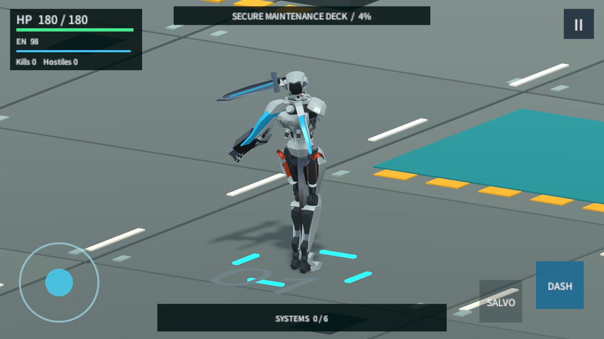 | 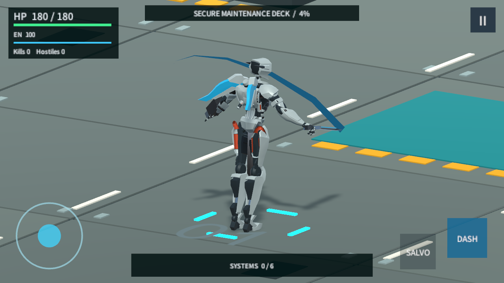 | 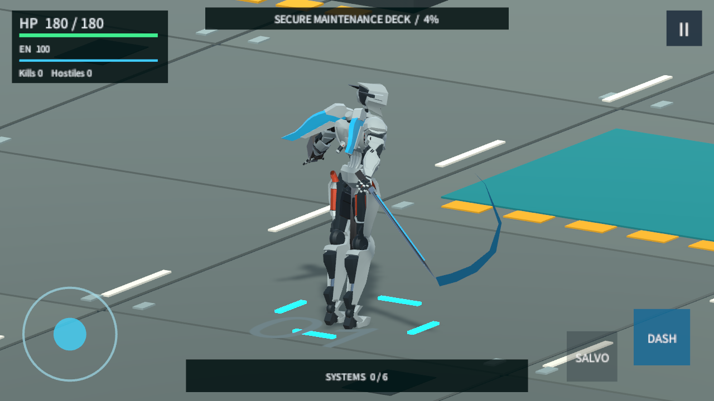 |

## Real Cannon And Salvo

These are triggered by the existing combat logic. A stationary diagnostic enemy receives real projectile damage; health is raised only on that target so it survives the short sequence. No player damage, cadence or cooldown numbers are changed.

| Cannon, frame 0 | Cannon, frame 1 | Missile salvo |
| --- | --- | --- |
|  | 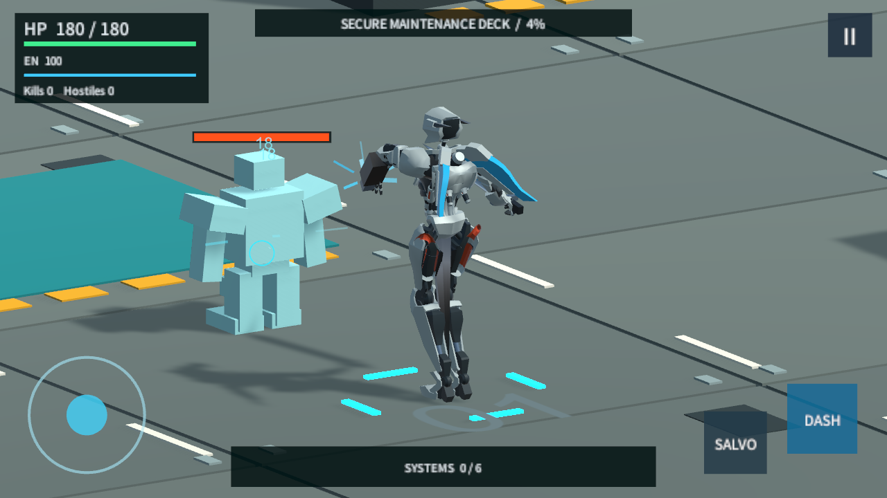 | 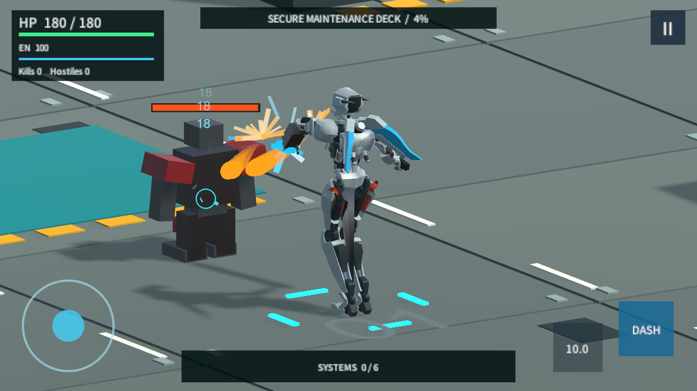 |

## Real Death

Damage is applied to kill the player in this focused test. The result overlay is hidden **only for these diagnostic captures**, so it does not obscure the body animation.

| Loss of balance | Collapse |
| --- | --- |
| 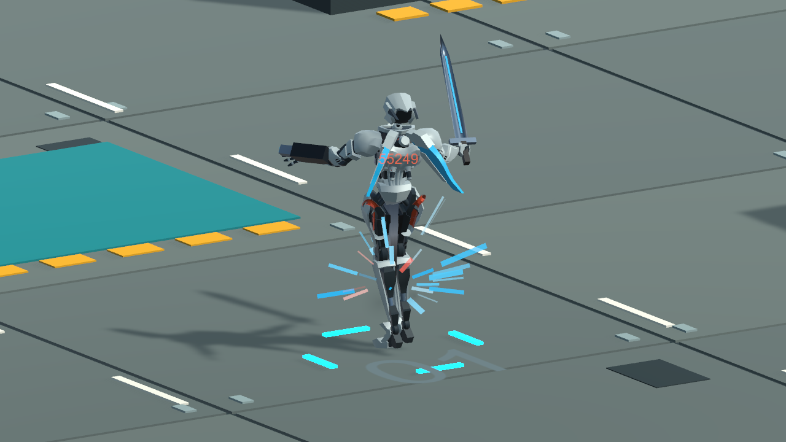 | 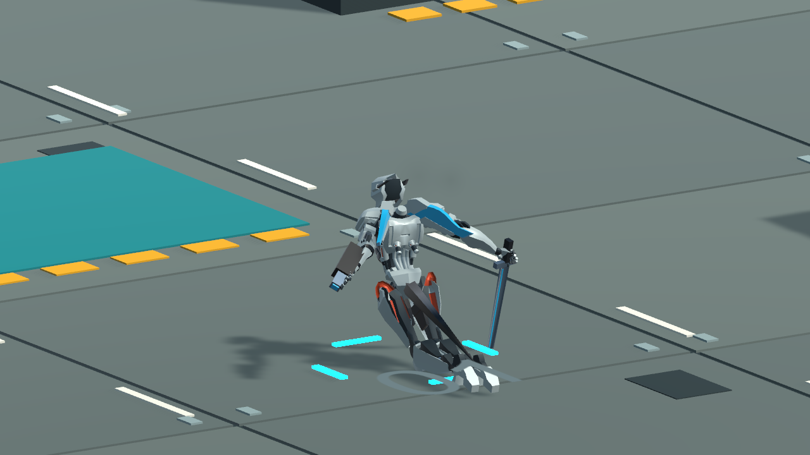 |

## Attribution And Limits

Final normal-speed release replay: [Boss phase two](audit-evidence/2026-09-05/hero-player-02/boss_2.png), [victory at 10:23](audit-evidence/2026-09-05/hero-player-02/result.png), [return to hangar](audit-evidence/2026-09-05/hero-player-02/restart_hangar.png), and [machine-readable report](audit-evidence/2026-09-05/hero-player-02/player-report.json). Six choices, both Boss phases and three restarts passed, with zero Player errors/warnings. These use the actual unchanged gameplay camera and continuous scene/UI rendering in the Windows Player.

Hero: [Rigged robot by joney_lol](https://poly.pizza/m/BwjA6Thdzd), [CC BY 3.0](https://creativecommons.org/licenses/by/3.0/). Adapted skin weights, motion, materials and attachments. Motion source: [Quaternius Animated Mech Pack](https://quaternius.com/packs/animatedmech.html), CC0. No creator endorsement implied. Keep this attribution with public reuse of these images.

Pose capture uses a fixed 1/60 simulation delta and is not a performance measurement. Full normal-speed combat validation is reported separately in [the handoff](HERO_MODEL_HANDOFF.md). Physical-phone performance, human aesthetic approval and playable melee/combo remain unverified.
