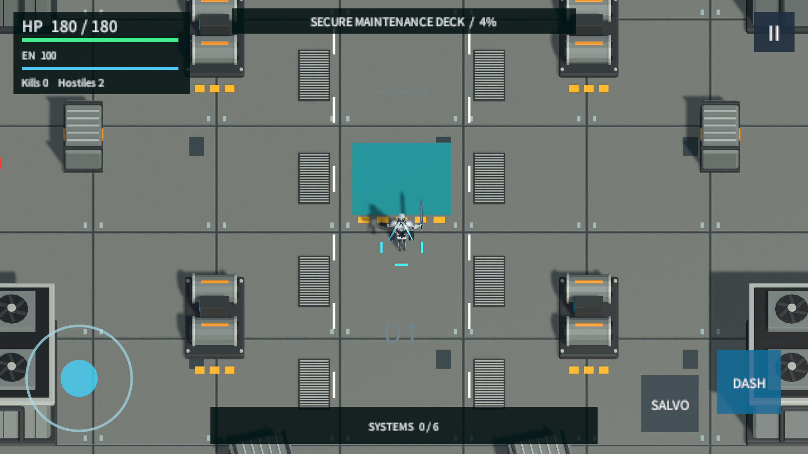
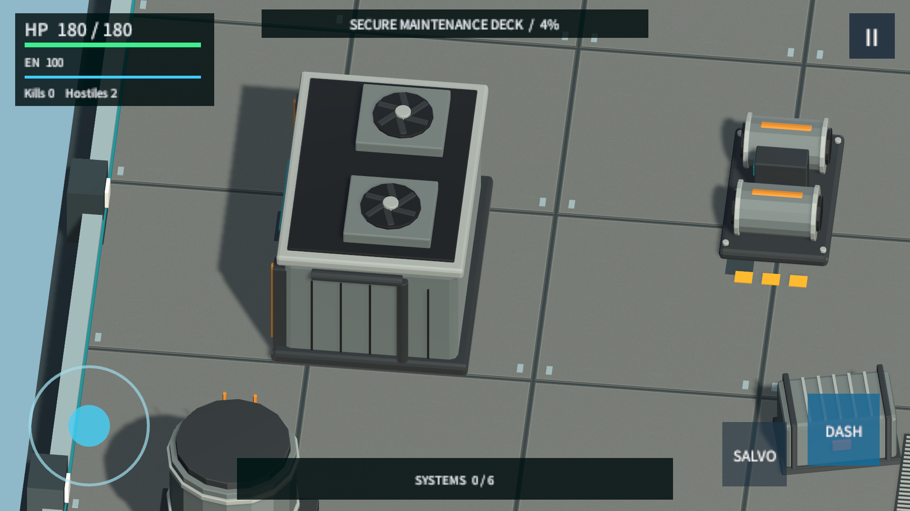
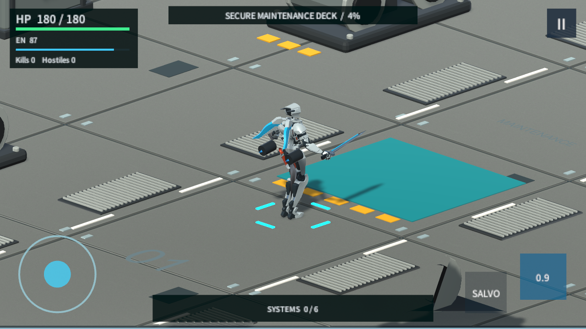
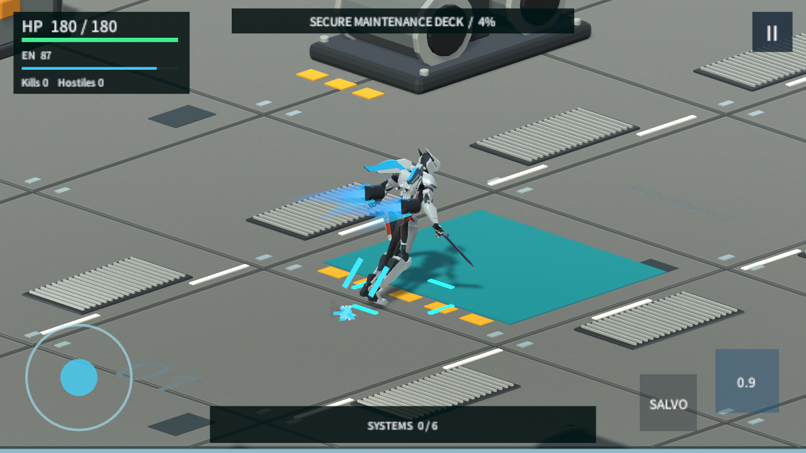
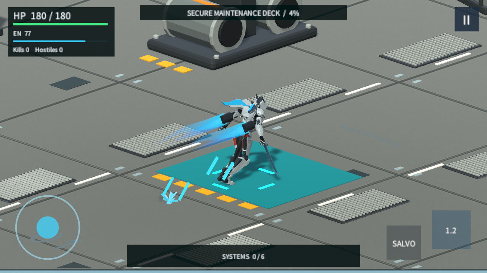
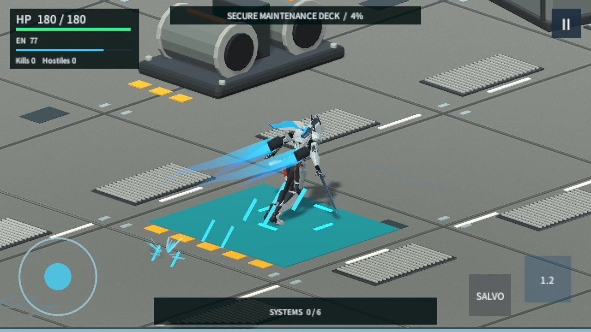
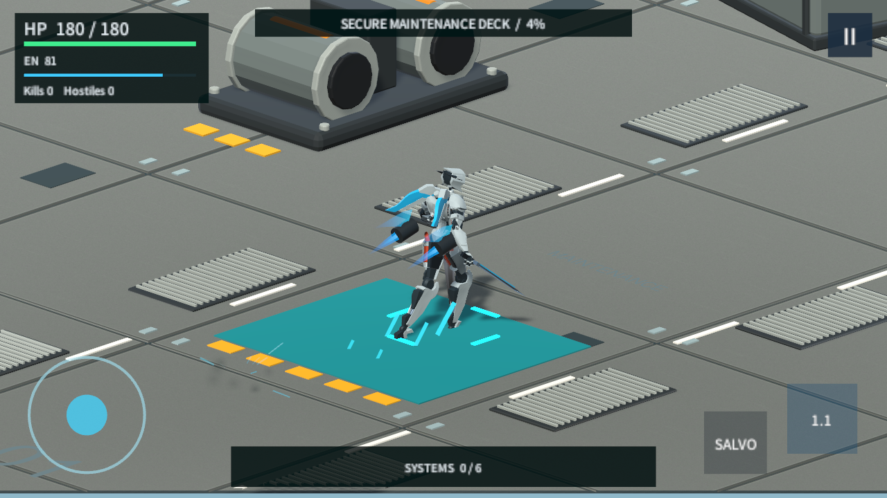
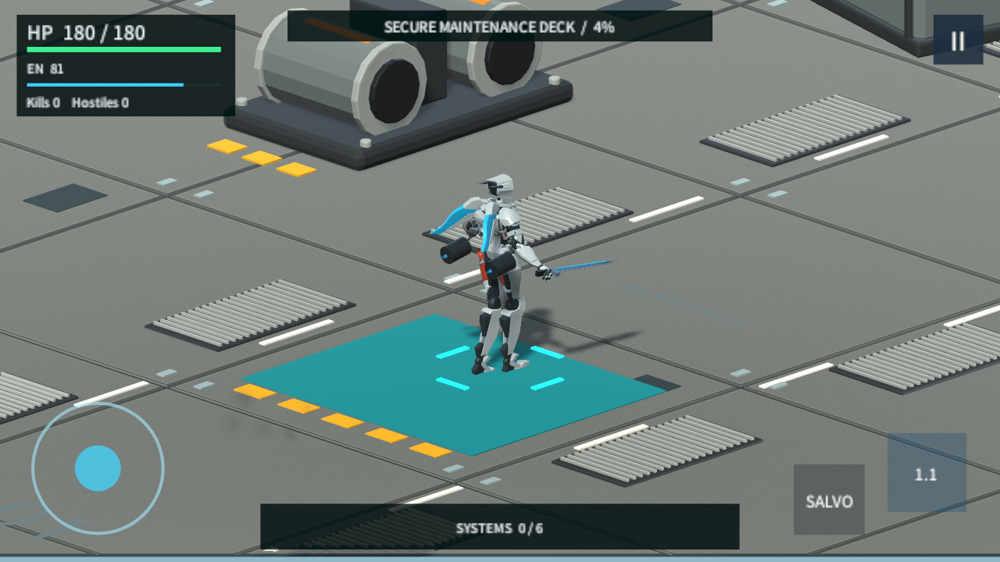

# Industrial Scene And Boost Evidence

These images come from real Unity Play Mode, not Blender renders or concept art. Fixed 1/120 simulation delta is used for dash pose samples only; that is not FPS evidence. The normal gameplay camera and diagnostic closeups are explicitly separated below.

## Scene

[Maintenance layout](audit-evidence/2026-09-05/industrial-01/02_layout.png) / [Reactor layout](audit-evidence/2026-09-05/industrial-01/04_reactor_layout.png). Buildings, cargo and pumps have collision and matching navigation; grates are visual-only floor details. Original FBX-axis failure captures are not used here.

## Dash Sequence

These captures follow the player with a diagnostic closeup camera. The hips/chest actually rotate and the backpack nozzles, jet cores and wakes move; the motor independently performs the dash.

| Ready | Launch | Sustained boost |
| --- | --- | --- |
|  |  |  |

| Late dash | Recovery | Back to idle |
| --- | --- | --- |
|  |  |  |

[Focused test assertions](audit-evidence/2026-09-05/industrial-01/report.txt) cover geometry orientation, entry routes, cover blocking, dash collision, body action, pause and equal travel at 30/60/120/240 simulated FPS. Full Player timings are reported separately in [the handoff](INDUSTRIAL_DASH_HANDOFF.md).

## Attribution And Limits

Final uncapped Windows Player **133754**: [Boss phase two](audit-evidence/2026-09-05/industrial-player-02/boss_2.png), [victory at 10:09](audit-evidence/2026-09-05/industrial-player-02/result.png), [restart](audit-evidence/2026-09-05/industrial-player-02/restart_hangar.png), [report](audit-evidence/2026-09-05/industrial-player-02/player-report.json). The normal-speed replay issued 324 successful dashes and completed six choices and both Boss phases with zero Player errors/warnings. Timing limitations are recorded in the handoff.

Hero shown: [Rigged robot by joney_lol](https://poly.pizza/m/BwjA6Thdzd), [CC BY 3.0](https://creativecommons.org/licenses/by/3.0/), modified skin/motion/materials/attachments. Motion source: [Quaternius Animated Mech Pack](https://quaternius.com/packs/animatedmech.html), CC0. New industrial modules and boost geometry are project-authored. No creator endorsement implied; preserve attribution with public reuse.

This first scene/boost pass does not certify finished environment art, Hades-equivalent human feel, phone performance, improved Build depth, melee/combo or difficulty. Those require further work and/or user playtesting.
