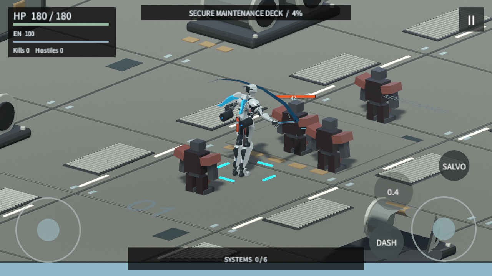
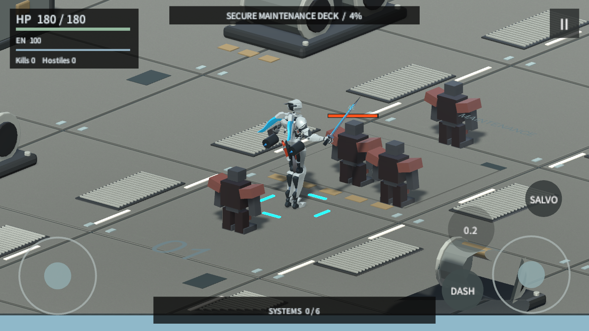

# Manual Combat And Restrained Palette / 2026-09-05

Continues from `5159dd6`, not an older project snapshot. Separate hero modeling files, active FBX/controller, encounter schedules, upgrade data, dash distance and desktop uncapped settings are preserved.

## Current Controls

- WASD / left stick: move independently of facing.
- Mouse: aim. Hold left button: beam fire. Right button / Q: slash.
- Right touch stick: hold and deflect to aim and shoot; center dead zone and release stop fire. Separate pointer ownership from movement.
- Space / DASH: dash. E / SALVO: existing guided missiles, with automatic visible-target selection only for missiles.
- No autonomous beam shooting. The old serialized `automaticFire` field is retained but ignored.

## Implementation

`PlayerInputRouter` carries explicit aim/fire/slash commands. Mouse UI raycasts prevent button clicks becoming shots; focus/pause clears held state. Manual sight rays converge the offset hand cannon on the first intersected surface, without selecting enemies outside the ray.

`PlayerMeleeController` owns a single 0.6s swing, 0.68s cooldown, 0.17-0.42s active window, 3.5m center range and approximately 139-degree forward arc. Base damage 42 inherits existing player/run damage multipliers. Each actor is hit once per swing; friendly, dead, distant and occluded actors are excluded. It is not a combo or new upgrade system. Dash and pause cancel pending hits. Beam/skill fire is suppressed during the swing.

`RiggedMechAnimator` subscribes to actual attack events and reuses SwordSlash; it does not grant damage. Existing blade trail follows the animated hand. A reused CC0 Kenney force-field cue accompanies the swing; hit feedback uses existing damage events. No new downloaded assets or licenses.

`ManualCombatPalette.Apply` reproducibly sets eight existing materials to muted graphite/oxidized metal tones and changes nine floor-renderer references to the existing textured worn deck. No collider/navigation/geometry changes. HUD bars and touch controls use muted colors; danger cues remain readable. If regenerating the older industrial builder, apply this palette pass afterwards.

## Verification

- `ManualCombatAudit.Run`: real Unity Play Mode. No auto-fire; held directional shots damage front target; release stops shots; dual-stick pointer independence; slash windup, actual damage once, rear/far/friendly exclusion, multi-collider target, wall occlusion, dash/pause cancellation, missile skill and uncapped settings. Final report: 0 runtime errors, 0 warnings; one known UnityEditor SearchDatabase startup exception is recorded separately.
- Continuous slash captures show the arm and blade moving, with a 42-damage hit during the swing. Measured arm rotation exceeds 108 degrees, rather than only checking an Animator state.
- Desktop landscape and wide-phone aspect screenshots are captured. These are synthetic pointer tests, not physical phone multitouch or a human assessment of feel.
- Windows release `20260905.144944`: strict build 0 errors / 0 warnings. Independent normal-speed Player replay passed: 606.38 seconds, six upgrade choices, 498 kills, 324 dashes, both Boss phases, victory and three restarts; 0 Player errors / 0 warnings. No forced kills or time acceleration. Evidence: `audit-evidence/2026-09-05/manual-player-01/player-report.json` and `Player.log`.
- `HeroVisualAudit.Run` also passed actual skin deformation for idle, run, dash, cannon and death, with no runtime errors; evidence in `manual-hero-01/`. Its preview slash is explicitly not the playable damage test.

Evidence: `audit-evidence/2026-09-05/manual-01/`. New source can be exercised with `ManualCombatAudit.Run`; `HeroVisualAudit.Run` remains a separate animation regression and labels its diagnostic slash correctly.

## Playable Package

`Builds/Windows/MECH_TRIAL_20260905.144944/MECH_TRIAL.exe`, with same-named ZIP. SHA256: `A5FB47CA6762449270585C6C956121A5FBF39F9291E2FFEE963885D61CA09B2B`.

## Continuous Action Evidence

Windup, active slash with damage, recovery; actual running game, diagnostic closeup camera:

## Limits

The main character is unchanged while separate modeling work continues. This pass reduces saturation and large colored panels; it does not replace the geometric enemies or promise final environment art. No physical Android/iOS build, phone performance or human audio/aim feel acceptance is claimed. Full replay injects manual aim/fire commands for automation, not an automatic-fire production mode. Concurrent Editor checks mean its timing is not a clean performance benchmark.

Old builds remain available for rollback. No push or merge is authorized. Unrelated untracked files are intentionally excluded from the commit.
