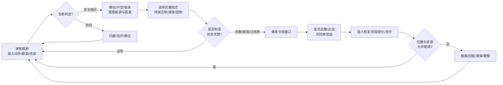
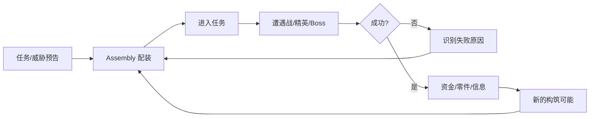
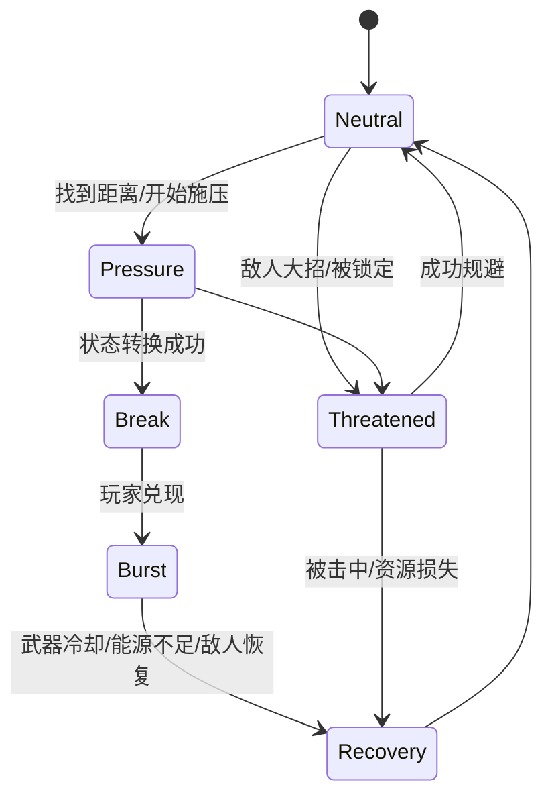

# 《装甲核心 VI》式机战动作 Demo 深度诊断：为什么“能动、能打、特效也有”，却还是不好玩

## 执行摘要

在没有看到你的 Demo 实机录像、参数和埋点前，我不能直接断言具体病灶，但对照《装甲核心 VI》《Armored Core: For Answer》《Zone of the Enders 2》《Vanquish》《Daemon X Machina: Titanic Scion》等样本后，我的核心判断很明确：**最值得优先怀疑的不是内容量、建模或特效数量，而是战斗缺少“状态转换”带来的节奏和决策闭环。**《装甲核心 VI》的强项并不只是高速移动和四武器齐射，而是“读威胁 → 调整距离/能量 → 施压累积冲击 → 制造失衡 → 爆发直击 → 敌人反扑/阶段转换 → 重新决策”，同时把配装直接接进这条循环。官方也明确把 Assembly、机体操纵、四武器协同、Stagger 与针对挑战重新配装视为核心体验。citeturn2view0turn2view1turn2view2

因此，你现在最不该做的是继续堆关卡、Boss、技能树和更大的粒子。优先做一个 **20–30 秒就能反复验证的战斗实验室**：先证明移动有战术意义、攻击能改变敌我状态、强攻击存在清晰兑现窗口、命中反馈与机械结果同步，再扩内容。VFX 只能放大已经存在的状态变化；底层没有决策收益时，粒子再多只会变成视觉噪声。

## 方法与数据来源

本研究采用“官方设计意图 → 实际系统结构 → 玩家反馈 → 人因/交互研究 → 可测量工程指标”的证据链。关于《装甲核心 VI》，优先使用 FromSoftware、Bandai Namco、PlayStation 官方材料及制作人小仓康敬、总监山村优的访谈；官方明确指出 Assembly 是系列核心，部件不仅改变数值，也会改变机体操纵感，腿部、武器、推进/能源系统会直接改变玩法；四个武器可以同时参与战斗，而冲击与 Stagger 系统负责创造高伤害窗口。citeturn2view0turn2view2

玩家论坛、Steam 社区和中文攻略只作为“哪些系统容易被玩家感知、滥用或抱怨”的补充证据，而不拿来替代官方机制说明。例如玩家普遍会把快速累积冲击 → Stagger → 高爆发当作强力 PvE 解法；与此同时，也有玩家批评 Stagger 在某些情况下过于主导战斗，甚至把决策压缩成“谁先打出失衡”。这恰好说明：**你的 Demo 需要状态转换，但不应该无脑照抄 AC6 的 Stagger 条。** citeturn14search3turn9search2turn9search4

动作“爽感”的研究参考包括针对动作游戏 Impact Feel 的研究，该研究把 hit stop、声音与动作的一致性、相机控制等列入影响打击感的关键变量；近期关于 screen shake 的实验也发现震屏强度和持续时间会影响主观冲击与 agency，但过量会损害可读性，因此它更适合作为**分级反馈工具**，而不是所有攻击统一开满。citeturn7search13turn7search3turn7search2 输入响应方面，NVIDIA Research 在高水平玩家任务实验中发现，降低系统延迟能够改善表现；视听同步研究则表明，人类在部分实验条件下可以感知几十毫秒级的异步，因此“命中发生了但声音/闪光晚到”确实可能破坏动作可信度。citeturn6view5turn5search7

玩家心理部分主要借鉴 Self-Determination Theory 在电子游戏中的研究：能力感、选择/自主感与游戏享受存在稳定关联；另一类 flow 研究则显示，挑战与技能匹配比单纯降低难度更容易维持投入。citeturn8search13turn8search1

**一个重要限制：你当前没有提供 Demo，因此后文对 Demo 的诊断全部属于“基于比较样本的高概率假设”，不是实测结论。** 我也没有找到 FromSoftware 对外公开的 AC6 内部可用性测试录像或正式 UXR 数据集；公开可用的主要是官方试玩、媒体试玩和玩家录像。Bandai Namco 的官方长篇 Gameplay Preview 可以用于逐帧观察战斗节奏、镜头和信息层级，但压缩后的公开视频不能可靠反推出原始粒子数、真实音频频谱或引擎内部输入延迟。citeturn0search2turn2view2

### 核心循环拆解方法

我建议不要用“移动不错 / 射击不错 / 特效不够爽”这种模块式评价。先把一次战斗拆成**状态机**。



《装甲核心 VI》非常接近这种结构：Assault Boost 能迅速把远距离状态转化为近距离交战；不同武器负责不同程度的 Impact；持续压力或重击造成 Stagger，随后 Direct Hit 奖励玩家爆发，四个武器槽则允许玩家构造不同的压力与兑现组合。官方甚至直接用机枪、导弹累积冲击后用近战进行高伤害攻击作为例子。citeturn2view1turn2view0

宏观循环则是：



这点很关键。**AC6 的车库不是战斗之外的 Excel；车库本身就是战斗循环的一环。** 山村优明确表示，希望玩家不断面对挑战、重新优化 Assembly，而部件应该改变实际玩法与操纵感，而不只是让某个百分比上涨。citeturn2view0

## 对比样本与核心循环

我建议用 AC6 做主样本，再选五个侧重点不同的参照物。它们不是都要学，而是分别回答五个问题：**怎么让移动本身好玩、怎么让高速动作仍然可读、怎么把移动接入进攻、怎么避免“配装深但战斗空”、多人机战怎么处理高信息密度。**

| 样本 | 为什么选 | 最值得拆的部分 | 不建议直接照抄 |
|---|---|---|---|
| **Armored Core VI** | 当前最完整的高速 3D 机战“配装—操控—战斗”闭环 | EN、距离、四武器、Impact/Stagger、Direct Hit、Assembly | 不要把 Stagger 复制成唯一最优策略 |
| **Armored Core: For Answer** | 极端高速机动范本 | Boost、Quick Boost、高速空间转换、速度幻想 | 速度过高会扩大镜头与信息可读性问题 |
| **Zone of the Enders 2** | 高速 3D 锁定式战斗的重要老样本 | 锁定、近远距离转换、目标居中、空中空间感 | 现代机战不能只靠强锁定解决所有瞄准问题 |
| **Vanquish** | 非传统机甲，但 3C/Game Feel 价值极高 | Boost 滑行直接承担进攻、规避、换位功能 | 它的竞技场尺度不能原样套到大型机甲 |
| **Daemon X Machina: Titanic Scion** | 很好的“反例/对照组” | 大量机甲自定义与高速移动 | 有深度配装并不能自动解决遭遇与反馈疲软 |
| **Mecha BREAK** | 现代多人机甲动作参照 | 地空转换、角色定位、多人 HUD/威胁识别 | PvP 角色制循环不等价于 AC 式单机循环 |

FromSoftware 官方一直将 Armored Core 系列定位为可高度自定义的机甲动作，而 AC4 系列尤其强调高速机甲战斗；AC6 则有意让平均速度低于 AC4 的峰值，同时允许某些时刻通过突进等机制骤然提速。这是一个很聪明的变化：**爽感来自速度差，而不是永远高速。** citeturn10search1turn10search26turn2view1

《Vanquish》更值得独立开发者认真研究。PlatinumGames 对其核心描述就是高速 Boost、精确射击和 AR 慢动作之间的组合，Boost 不是“跑得快”的动画，它同时承担接近、撤离、侧移、进攻路线设计以及风险控制，所以玩家几乎每次移动都在做战斗选择。citeturn13search13turn13search16

《ZOE2》的价值在于证明，高速三维动作必须有非常强的目标组织。其锁定系统持续把玩家与目标关系维持在镜头可理解范围内，让高速空战不至于退化成“我在哪、敌人在哪”。citeturn3search12

《Daemon X Machina: Titanic Scion》则非常适合作为负面参照。官方仍主打高度自定义 Arsenal、高速陆空战斗与大型 Boss，但部分专业评测认为它虽然自定义很深，实际战斗与开放区域却显得松散、缺乏张力。它说明“零件很多 + 飞得很快 + 机甲很帅”完全可能仍然不好玩。citeturn3search11turn3search5turn3search25

下面这张雷达图是我根据上述官方资料、评论与系统结构做的**研究者启发式评分**，1–10 分，不是从游戏引擎读取的客观数据。它的意义只是帮助你看到几个设计方向的差异。


[下载原图](sandbox:/mnt/data/mecha_combat_heuristic_radar.png)

雷达图最值得看的不是谁总分最高，而是 **AC6 五个轴互相咬得最紧**：

> 配装改变武器和移动方式 → 武器改变有效距离与冲击能力 → 移动控制距离与能源 → 冲击制造爆发窗口 → 爆发又要求提前留武器和位置 → 战斗失败反过来促使玩家换装。

它形成了一个闭环。官方访谈对这种“Assembly 不只是数值，而是改变实际玩法”的强调非常明确。citeturn2view0

你的 Demo 最值得问的一句话因此变成：

**“我的移动、武器、敌人和反馈，是在共同推动一个循环，还是四套各自能运行的系统？”**

后者是绝大多数“看起来像游戏，但玩起来像技术 Demo”的根本问题。

## 详细发现与证据

**核心循环：最优先排查有没有“状态转换”。**

一个射击游戏最容易做出来的循环是：

> 看到敌人 → 按攻击 → 敌人掉血 → 重复 → 敌人死。

这个循环 technically 是完整的，但决策密度极低。只要枪的 DPS 最高、射程够、安全性够，玩家就没有理由改变行为。

AC6 在 HP 之外又加了一层 ACS/Impact。玩家首先需要制造状态优势，然后在短窗口内把高 Direct Hit 武器兑现进去。于是“什么时候射、用哪个武器射、什么时候保留武器、什么时候突进”都有了时间价值。官方明确说明不同武器的 Impact 与有效距离不同，而 Stagger 后能够获得高 Direct Hit 奖励。citeturn2view0turn2view1

但我要特别提醒：**状态转换 ≠ 必须做一根失衡条。**

你可以做：

> 护盾破坏 → 核心暴露  
> 装甲加热 → 热失控  
> 部件损坏 → 武器/移动功能下降  
> 锁定压制 → 导弹齐射窗口  
> 装甲裂解 → 穿甲武器收益上升  
> 电磁积累 → 敌人动作短暂停滞

重点是让玩家完成：

**状态 A → 通过正确行动进入状态 B → B 允许原本不划算的高风险行为变得划算。**

这样才会产生节奏。

玩家对 AC6 的讨论也暴露了这个机制的上限：Stagger 很成功，但如果“最快累积冲击然后一次爆发”压倒其他策略，它同样会把构筑空间压扁。中文玩家攻略和社区讨论中，快速冲击 → 硬直 → 爆发就是常见强势解法。citeturn14search3turn14search9turn9search4

所以你的目标不是做“AC6 的黄条”，而是做：

> **至少两种制造机会的路径 + 至少两种兑现机会的路径。**

例如：

| 施压方式 | 形成状态 | 兑现方式 |
|---|---|---|
| 机枪持续压制 | 装甲过热 | 近战切入 |
| 导弹逼位 | 敌人闪避资源耗尽 | 重炮预判 |
| EMP | 护盾失效 | 能量武器 |
| 精确攻击腿部 | 机动受损 | 中远距离火力 |
| 高风险贴脸 | 快速冲击累积 | 打桩机/霰弹爆发 |

这时候 Build 才开始真正有意义。

**战斗节奏：一直爽等于没有爽。**

AC6 的节奏并不是全程满速。官方描述中 Assault Boost 的一个重要作用就是“瞬间从远距离切进近距离”；山村也表示平均速度介于系列较早作品之间，但特定状态可以达到接近 AC4 式的高速。换句话说，它在主动制造速度差。citeturn2view1

你需要至少有四个节奏状态：



推荐把一场精英/Boss 战录下来，只看时间轴，不看画面。

如果得到的是：

`████████████████████████`

说明从头到尾都一样忙。

你真正需要的是类似：

`───████──██────██████───█──`

有蓄势、危险、爆发和喘息。

这也是为什么很多初版 Demo 加了一堆枪口火、拖尾和屏幕震动后依旧无聊：**感官层一直在喊“高潮”，系统层却没有高潮。**

**决策点：不要数按钮，要数“有代价的选择”。**

一次攻击键不是一次决策。

真正的决策至少要满足：

1. 当下存在两种以上合理动作；
2. 不同动作有不同成本；
3. 选择会改变未来几秒的局面。

例如：

> 我现在把火箭打掉，能够更快 Break，但敌人真的失衡时火箭还在 CD。

这才是决策。

AC6 四武器同时可用、EN 管理、距离适性、突进和 Stagger 状态之所以相互配合，就是因为“现在用什么”和“留什么到之后”存在机会成本。citeturn2view0turn2view1

我建议你的 active combat 第一版把目标定成：

**每 1.5–3 秒出现一次有意义决策。**

也就是约 20–40 个 meaningful decisions/minute。这个范围是本报告给 Demo 调试提出的**实验目标，不是行业标准**。实际要通过录像编码验证。

如果玩家 10 秒都在：

> 左键按住 + 横向移动

那么就算屏幕上有四百发导弹，也是在做同一件事。

**视觉爽感：关键不是粒子数量，而是“命中事件的层级一致”。**

Impact Feel 研究把 hit stop、声音一致性、相机等因素视作打击感的重要组成部分。citeturn7search13 一个重击事件至少有六层：

| 层 | 玩家需要感受到什么 |
|---|---|
| 输入 | 我按下去了 |
| 发射 | 武器真的产生力量 |
| 飞行/挥击 | 力量正在传递 |
| 接触 | 打中了这里 |
| 目标反应 | 对方受到影响 |
| 战术结果 | 这次命中改变了局面 |

很多 Demo 只有第 2 和第 4 层：

> 枪口闪一下 → 敌人身上爆粒子。

于是看起来“有特效”，身体却不信。

真正的重击应该发生一组高度同步的事件：

`输入`
→ 武器机构反冲  
→ 枪口/推进器变化  
→ projectile/contact  
→ impact flash  
→ 短促 camera impulse  
→ 目标 pose/velocity 改变  
→ 音频 transient  
→ HUD 状态明显改变  
→ 机械结果产生

如果最后的“机械结果”不存在，前面全是包装。

**这里最容易犯的错误就是所有枪共享一套 Hit Effect。**

轻机枪、重型榴弹、能量炮、近战打桩机至少应该在以下维度不同：

> 相机冲量  
> 目标位移/姿态  
> hit stop  
> 屏幕空间 VFX 面积  
> 高频 transient  
> 低频 body  
> 残留时间  
> 状态伤害  
> UI hit confirm

否则武器表里有十把枪，玩家身体只感觉“一把枪换了皮”。

**声音：重不等于低频越多。**

一个重型机械冲击更适合分层：

`瞬态 click/crack`  
+ `机械 body`  
+ `低频 weight`  
+ `环境 tail`

高频瞬态负责告诉耳朵“什么时候撞上”，低频负责重量，尾音负责空间。视听同步研究说明，人类在特定实验条件下能够察觉几十毫秒级不同步，因此关键击中事件的声音不应该明显落后于视觉。citeturn5search7

另外要给真正重要的命中留动态范围。如果机枪、BGM、推进器、导弹报警、NPC 通讯全都满响，重炮到来时已经没有地方再“变大”。

**移动与操控：机甲爽的核心不是速度，是加速度和承诺感。**

AC6 的移动值得学的地方是：

> 普通移动有普通速度；  
> Quick Boost 是短促状态变化；  
> Assault Boost 是明显的长距离进攻承诺；  
> 空中机动受到 EN 与机体配置约束。

官方将 Assault Boost 明确定位成既用于快速穿越，也用于把远距离交战转化为近身攻击的机制。citeturn2view1turn2view2

所以 Demo 要检查一个问题：

**Boost 有没有改变战术，还是只让 Transform.position 更快？**

差的 Boost：

> 按 Shift → 移速 × 2。

好的 Boost：

> 按 Shift → 瞬间加速度  
> → 相机和 FOV 表达速度  
> → 推进器声场和尾焰改变  
> → 移动轨迹改变  
> → EN 产生代价  
> → 射击性能/近战能力改变  
> → 接近敌人后存在明确收益。

《Vanquish》的 Boost 之所以值得研究，就是因为它直接把移动纳入战斗语法，而不是单纯的赶路工具。citeturn13search13

**镜头与尺度：机甲明明跑得快，却可能完全没有速度感。**

这在独立机甲 Demo 里非常常见。

速度感高度依赖：

> 近景物体掠过速度  
> 地面纹理  
> 平行视差  
> 机体相对画面占比  
> FOV 变化  
> 镜头延迟  
> 动画/喷口响应  
> 环境尺度参照物

一台 100 km/h 的机器人，如果在巨大而空旷的平地上跑，镜头又离它 30 米，视觉上很可能像在慢走。

所以**不要先把移动速度继续加大。**

先给玩家速度参照：

> 建筑边缘  
> 电线杆  
> 桥梁支柱  
> 地面碎石  
> 小型车辆  
> 栏杆  
> 低空可掠过结构

相机 FOV 也需要谨慎。一般显示环境中 FOV 与观看距离不匹配会增加不适风险，游戏无障碍指南把桌面显示器约 90° 一带作为常见参考；但第三人称机战的实际数值仍然必须结合镜头距离和平台验证。citeturn12search17turn12search13

**敌人设计：如果敌人只分血厚和血薄，你的所有 Build 最终都会退化成 DPS 比较。**

AC6 的 Boss 强调观察攻击模式、找到突破方式，并允许玩家在失败后针对敌人调整 Assembly。citeturn2view0turn2view2

你第一版根本不需要二十种敌人。需要的是五种**功能角色**：

| 敌人 | 它逼玩家学什么 |
|---|---|
| 压迫型近战单位 | 距离控制 / QB |
| 远程炮击单位 | 换位 / 垂直移动 |
| 盾型单位 | 绕后 / 状态破坏 |
| 高机动单位 | 锁定管理 / 预判 |
| 重型精英 | 施压 → 状态转换 → 爆发 |

五个模型甚至可以共享部分骨骼和素材。

最怕的是：

> Enemy_A_HP = 100  
> Enemy_B_HP = 200  
> Enemy_C_HP = 500

这不叫三种敌人，这是三种血条。

**关卡：不要让移动能力和空间设计互相打架。**

机甲拥有高速横移、Boost、跳跃、飞行，但场景却只有宽阔平地，这等于把 3D 移动系统压成二维。

战斗空间应该不断改变价值函数：

> 开阔地：导弹/远程占优  
> 柱廊：近战与绕视野占优  
> 垂直井：能源管理变重要  
> 狭窄通道：爆炸武器价值提高  
> 多层结构：锁定与路线选择变重要

AC6 官方强调大型、多层的关卡以及地空机动，并把 Assault Boost 同时用于穿越和战斗。citeturn2view2

**UI：战斗已经复杂，UI 就不能再让玩家自己算账。**

玩家在高速战斗中至少要同时理解：

> 自己生命  
> EN  
> 武器状态  
> 敌人位置  
> 敌人攻击预兆  
> 当前有效距离  
> 状态积累  
> 是否进入爆发窗口

因此 UI 最大的问题通常不是“不够帅”，而是这些信息优先级一样。

建议只把三个问题做到几乎不需要思考：

> **我现在危险吗？**  
> **敌人现在脆弱吗？**  
> **我有什么东西能用？**

其他信息可以退后。

尤其是爆发窗口，如果需要玩家盯着一根小黄条判断“是不是已经 Stagger”，那就是 UI 没有把系统层级传递到感觉层。目标动画、声音、HUD、颜色/形状变化应当同时确认。

**性能：平均 60 FPS 没什么用，稳定的 frame pacing 更重要。**

AC6 PC 版本支持包括 120 FPS 在内的高帧率设置，官方后续补丁也专门修复过 120 FPS 设置相关问题。citeturn11search24 对你的 Demo 来说，不需要追求 AC6 的规模，但高速移动和短窗口操作会放大延迟与帧时间尖峰的体感；延迟研究同样支持“低 latency 对高速操作任务更重要”的方向。citeturn6view5

如果游戏“通常 60 FPS”，但导弹齐射命中时从 16.7 ms 突然跳到 35–50 ms，你偏偏是在**最应该爽的瞬间卡顿**。

这是致命问题。

**教程：先教玩家为什么这么打，再告诉他还有几个按钮。**

AC6 为新玩家保留了教程，同时没有因此砍掉 Assembly 深度。citeturn2view0

你的教程推荐按：

`Learn → Test → Remix`

例如：

> 教 Quick Boost  
> → 一个明显横扫攻击让玩家躲  
> → 下一场同时出现横扫 + 远程导弹，迫使玩家组合走位。

再例如：

> 教状态积累  
> → 一个不会主动反击的精英  
> → 下一场精英会在玩家无脑射击时反扑。

教程的验收标准不是：

> “玩家有没有按出 Q。”

而是：

> “十分钟后没有提示，他还会不会在正确的局面按 Q。”

**玩家心理：能力感必须来自“我理解了”，而不是单纯“数字更大了”。**

Self-Determination Theory 的游戏研究表明，competence 与 autonomy 和游戏享受高度相关；skill-challenge balance 研究也支持挑战与玩家能力匹配对投入的重要性。citeturn8search13turn8search1

因此一个好的 Boss 死亡应该让玩家想：

> “懂了，我刚才不该在这里交 Boost。”

而不是：

> “这 BOSS 血真厚。”  
> “它突然把我秒了。”  
> “我得回去刷 +10% 攻击。”

前者会形成 mastery motivation；后者只形成 grind motivation。

## 优先级问题与可执行改进

在没有你的 Demo 录像前，我会按下面顺序下注。这里的“假设强度”表示**我认为它解释“Demo 不好玩”的概率**，不是已经观察到你的 Demo 有这个问题。

| 优先级 | 高概率问题 | 为什么致命 | 假设强度 | 最快验证 |
|---|---|---|---|---|
| **P0** | 没有明显“施压 → 状态转换 → 爆发” | 战斗从头到尾同一节奏 | 很高 | 只加一套 Break/Burst 原型 |
| **P0** | 移动与进攻/防守脱节 | Boost 只是赶路，玩家没有移动决策 | 很高 | 给 Boost 加明确资源和进攻收益 |
| **P0** | 命中没有机械结果 | 特效只能装饰伤害数字 | 很高 | 给重击加入目标反应与状态变化 |
| **P0** | 敌人没有功能角色 | 最优策略长期不变 | 高 | 做 3 种行为完全不同的灰盒敌人 |
| **P1** | 镜头/场景缺少速度参照 | 数值很快，体感很慢 | 高 | 同一速度 A/B 不同镜头与环境 |
| **P1** | 武器反馈没有分级 | 十把武器身体感觉像一把 | 高 | 轻/中/重三档 Impact Profile |
| **P1** | 输入响应、动画前摇或 frame pacing 差 | 玩家觉得“粘”“飘”“不跟手” | 中高 | 高帧率录像 + frame-time log |
| **P1** | UI 不能快速表达危险/机会 | 玩家忙于读条，不是在战斗 | 中高 | 关 HUD 后观察系统是否还能读懂 |
| **P2** | 配装只改变 DPS/HP | Build 没有身份 | 中高 | 做两个“手感完全不同”的构筑 |
| **P2** | 教程只教按键 | 玩家知道怎么按，不知道为什么按 | 中 | 无提示复测 |
| **P2** | 成长系统太早介入 | 数值掩盖核心循环问题 | 中 | 暂时完全关闭成长系统 |

这里我非常建议你克制住一个冲动：

**不要先做成长系统。**

你的 combat sandbox 如果拿默认机体打同一个精英 20 次都不好玩，加入：

> 稀有度  
> 等级  
> 技能树  
> 装备掉落  
> 随机词条

只是在给一个坏循环增加延期付款。

### 改进路线

| 时间 | 做什么 | 预期效果 | 资源 | 主要风险 | 验收标准 |
|---|---|---|---|---|---|
| **1–2 周** | 建一个 Combat Lab，仅 1 个场景、3 个敌人、3–4 把武器 | 快速验证战斗底座 | 1 设计/程序 + 现有美术 | 忍不住继续做内容 | 玩家愿意主动重复战斗 |
| **1–2 周** | 原型一套“施压 → 状态转换 → 爆发” | 制造节奏与短期目标 | 程序 + UI/VFX | 变成唯一最优套路 | 至少 2 种施压、2 种兑现方式有效 |
| **1–2 周** | 轻/中/重三级 Impact Profile | 武器明显分层 | VFX/Audio/Camera | 过度震动 | 盲测能正确区分武器重量 |
| **1–2 周** | 记录 input、hit、audio、frame time | 把“感觉怪”变成数据 | 程序约 1–2 天 | 埋点错误 | 可导出 CSV 并与录像对齐 |
| **1–2 周** | A/B 动态 FOV + 相机距离 + 近景环境 | 提升速度感 | 程序/关卡 | 晕动 | 偏好提高且不增加明显不适 |
| **1–3 月** | 做 5–7 个功能敌人 | 逼出不同 Build/移动策略 | AI + 动画 | 内容量膨胀 | 每种敌人能改变玩家行为 |
| **1–3 月** | 8–12 种真正不同的武器 archetype | 建立 Build identity | 设计/程序/VFX/音频 | 数值空间爆炸 | 任意两套构筑战斗节奏明显不同 |
| **1–3 月** | 配装改变加速度、飞行、攻击承诺等 | 接通 meta 与 combat | 系统设计 | 平衡成本高 | 玩家能根据敌人主动换装 |
| **1–3 月** | 建 3 种空间语法的关卡 | 让三维移动有意义 | Level Design | 美术抢跑 | 同一 Build 在不同空间策略不同 |
| **1–3 月** | Learn-Test-Remix 教程 | 减少认知负担 | 设计/UI | 教程拖沓 | 无提示场景仍能正确应用 |
| **3 月以上** | Boss、成长、经济、长期 Build 多样性 | 扩展长期留存 | 全团队 | 核心仍未证明就扩产 | 多 Build 都有有效内容空间 |
| **3 月以上** | 高级 VFX、音频混音、破坏表现 | 把已有爽感继续放大 | 专业美术/音频 | 性能成本 | P99 frame-time 不被破坏 |
| **3 月以上** | Accessibility/Camera/输入完整配置 | 扩用户范围 | UI/QA | 配置组合复杂 | 核心操作和提示均可重映射/调节 |

第一阶段真正的完成标准，不是“Combat Lab 做好了”，而是：

> **一个陌生玩家在不知道你设计意图的情况下，能够自己发现“怎么制造机会 → 怎么兑现机会”，并觉得执行成功非常爽。**

如果这件事没发生，先别做下一个地图。

## 参数建议与量化验收

下面所有数值必须区分两类：

**文献/工程证据支持的是方向；具体数值区间则是我建议你用于第一轮原型的 tuning band，不是 AC6 官方参数，也不是行业标准。**

当前 Demo 没有提供任何数值，因此“当前值”全部标记为未提供。

| 指标 | 当前 Demo | 第一轮建议值 | 怎么测 | 为什么 |
|---|---:|---:|---|---|
| 目标帧率 | 未提供 | **稳定 60 FPS 最低目标** | frame-time log | 高速 3D 操作首先要稳定 |
| 单帧预算 @60 | 未提供 | 16.67 ms | profiler | 基础预算 |
| P99 frame time | 未提供 | **≤22 ms** 初步目标 | 连续 10 分钟记录 | 防止最爽瞬间尖峰 |
| 严重卡顿 | 未提供 | 正常战斗尽量无 >33 ms 尖峰 | log | 2 帧以上异常会明显破坏连续性 |
| 输入 → 首个可见响应 | 未提供 | **P95 ≤50 ms 理想；≤70 ms 最低实验目标** | 240 fps 摄像/埋点 | 本报告建议，不是行业硬标准 |
| 攻击输入缓冲 | 未提供 | 60–100 ms | 自动化/录像 | 容纳输入时序误差 |
| 闪避/QB 输入缓冲 | 未提供 | 80–120 ms | 同上 | 保证高速规避可靠 |
| 命中 → VFX 首帧 | 未提供 | ≤16.7 ms 理想 | collision timestamp → render | 减少“打中了才爆” |
| 命中 → 核心音效 onset | 未提供 | ≤16.7 ms 理想；P95 ≤33 ms | waveform + event log | 保持视听因果关系 |
| 关键命中 AV 偏移 | 未提供 | 尽量 **\|offset\| ≤20–30 ms** | 高帧率录像 + waveform | 实验表明几十毫秒异步可能被察觉 citeturn5search7 |
| 基础水平 FOV，16:9 | 未提供 | **85–95°** | A/B test | 速度感与舒适度折中；属建议值 |
| Boost FOV | 未提供 | 基础 +8–12° | A/B test | 制造速度变化 |
| FOV 拉宽时间 | 未提供 | 120–180 ms | timeline | 要感到加速，不要瞬间跳 |
| FOV 恢复 | 未提供 | 250–350 ms | timeline | 给减速留下重量 |
| 相机距离 | 未提供 | 约 **2.0–2.8 个机体高度** | screenshot ratio | 兼顾机体存在感与环境信息 |
| Boost pull-back | 未提供 | +0.2–0.5 个机体高度 | A/B | 加强推进速度参照 |
| 轻命中 shake | 未提供 | 0.1–0.25° / 60–100 ms | camera log | 不抢视觉 |
| 重命中 shake | 未提供 | 0.4–1.0° / 100–180 ms | camera log | 突出爆发；0.1–0.2s 也与相关实验最佳区间接近 citeturn7search3 |
| 连射武器 hit stop | 未提供 | 0–1 帧 | timeline | 避免持续卡顿 |
| 中重攻击 hit stop | 未提供 | 1–2 帧 | timeline | 提高接触感 |
| 重近战/终结攻击 | 未提供 | 2–4 帧，谨慎使用 | A/B | 强化特殊命中 |
| 小型 Impact 粒子 | 未提供 | 20–60/次作为起点 | profiler + screen capture | 重点看屏幕面积，不迷信数量 |
| 重型 Impact 粒子 | 未提供 | 80–200/次作为起点 | 同上 | 需要与小命中形成层级 |
| Impact 生命周期 | 未提供 | 0.12–0.35 s | frame analysis | 足够被识别，不遮下一步 |
| 战斗 VFX GPU 成本 | 未提供 | 先限制在约 0.5–0.8 ms | GPU profiler | 防止特效越爽越卡 |
| 重击临时 ducking | 未提供 | 背景下降 2–4 dB / 80–150 ms | A/B listening | 给重击留下动态范围 |
| 状态转换后爆发窗口 | 未提供 | **1.2–1.8 s** 第一版 | telemetry | 足够表达“机会”，又不能无脑输出 |
| 高伤攻击预兆 | 未提供 | **300–700 ms** 第一版 | tester success curve | 建立可读性 |
| meaningful decision 间隔 | 未提供 | **1.5–3 s** active combat | 视频行为编码 | 防止长时间 autopilot |
| 普通杂兵 TTK | 未提供 | 约 0.3–1.5 s | telemetry | 保留机甲火力幻想 |
| Elite TTK | 未提供 | 约 6–15 s | telemetry | 足够完成一次完整小循环 |

这里有两个最容易误用的参数。

第一，**Camera Shake 不是越大越爽。** 屏幕震动研究支持它能够提高冲击/agency，但持续震动会牺牲瞄准与视觉清晰度；因此推荐把它设计成“Impulse”，快速达到峰值后指数或 critically damped 衰减，而不是正弦抖个半秒。citeturn7search2turn7search3

可以先尝试：

\[
Shake(t)=A e^{-kt}\sin(2\pi ft)
\]

其中重击先取：

- \(A=0.4°\sim1.0°\)
- 总时长 \(100\sim180ms\)
- 峰值尽量在前 20–40ms
- 迅速衰减

近战重击可以让 rotational impulse 大于 positional impulse，避免整个世界像摄像机被人踢了一脚。

第二，**Hit Stop 不应该全局乱冻。** 射击游戏尤其要小心。对于持续连射武器，大量全局 hit stop 会破坏输入连续性；更好的方案往往是给目标动画、局部特效、武器 recoil 和 camera impulse 加强，而把明显时间冻结留给极少数近战重击/处决。

### “爽感”怎么量化

我建议给你自己建一个内部指标，暂时叫 **IFI：Impact Feel Index**。它不是学术标准，仅用于版本之间 A/B。

\[
IFI =
0.20R +
0.15S +
0.20T +
0.15C +
0.15A +
0.15M
\]

其中：

| 项 | 含义 |
|---|---|
| **R Response** | 输入到动作是否及时 |
| **S Synchrony** | 视觉/声音/目标反应是否同步 |
| **T Target Reaction** | 敌人姿态、速度、部件有没有响应 |
| **C Camera/Haptic** | 镜头/震动是否与攻击等级匹配 |
| **A Audio** | transient、body、动态范围是否明确 |
| **M Mechanical consequence** | 命中是否产生真实战术结果 |

每一项让玩家打 1–7 分，再归一化成 0–100。

这里我故意给 **Mechanical consequence 15%**。

因为：

> `超炫爆炸 + 敌人完全没反应 + 血条掉 3%`

往往仍然很虚。

而：

> `清晰接触 + 敌人姿态崩掉 + 护甲破裂 + 出现两秒攻击窗口`

哪怕 VFX 没那么豪华，也会明显更爽。

### 输入响应要看分布，不要只看平均数

下面是我为 Demo 验收方式生成的一张**模拟示意图**。数据不是你的 Demo 数据，只是展示测量后理想的统计形状。


[下载原图](sandbox:/mnt/data/target_input_response_histogram.png)

真正测试时记录：

`InputTimestamp`
`ActionStartTimestamp`
`FirstVisibleMotion`
`ProjectileSpawn`
`HitEvent`
`FirstHitVFX`
`AudioTrigger`
`Stagger/BreakEvent`
`FrameTime`

最后不要只说：

> Average latency = 42 ms。

我要看：

> Median  
> P90  
> P95  
> P99  
> worst 1%  
> 战斗压力高时 vs 安静场景时

低延迟研究支持系统 latency 会影响高水平操作表现，所以最危险的情况通常不是“始终多 10ms”，而是在导弹、粒子、AI 同时爆发时响应突然恶化。citeturn6view5

### 最便宜的测量办法

不需要一开始买专业延迟仪。

把手机开到 240 fps：

1. 镜头同时拍到手柄按键/鼠标与屏幕。
2. 连续执行 Quick Boost 50 次。
3. 数“按键物理运动首帧”到“机体首次可见移动帧”。
4. 240 fps 下，每帧约 4.17 ms。
5. 算 median / P95，而不是挑最好的一次。

Hit feedback 同理：

> projectile contact frame → impact flash → target reaction → sound waveform onset。

声音最好同步录制游戏 audio，再把录像和波形对齐。

### 可直接逐帧研究的资料

AC6 最值得首先研究的是 Bandai Namco 官方 Extended Gameplay Preview，里面能直接观察高速穿越、四武器使用、空中机动、Stagger 和 Boss telegraph。citeturn2view2turn0search2

PlayStation 对山村优、小仓康敬的访谈更适合研究“为什么这么设计”，尤其是 Assembly、腿部差异、四武器、Stagger、Target Assist 与 EN 的设计目的。citeturn2view0turn2view1

《Vanquish》则建议把 PlatinumGames 官方资料和实际 Gameplay 并排看，重点观察 Boost 前后机体占屏比例、镜头追随、移动与进攻切换，以及普通移动与高速滑行的视觉反差。citeturn13search13turn13search16

不要直接从 YouTube 压缩视频数“它有 147 个粒子，所以我也做 147 个”。有价值的是相对规律：

> 大招比小招占多少屏幕面积；  
> peak 在接触前还是接触后；  
> VFX 多久开始衰减；  
> 命中瞬间有多少种反馈同步到达；  
> 下一次玩家需要读敌人动作时，屏幕是否已经恢复清晰。

## 结论与下一步实验计划

如果现在让我在**完全没看你的 Demo**的情况下押一个根因，我会按这个顺序押：

**第一：战斗缺少可感知的状态变化，所以没有“蓄势 → 兑现”的高潮。**

**第二：移动看起来像机甲，但没有足够战术后果，所以玩家主要是在移动摄像机和准星。**

**第三：攻击有 VFX，却没有形成“视觉 + 声音 + 目标反应 + 镜头 + UI + 机械结果”的同步事件。**

**第四：敌人没有强迫玩家改变行为，所以几个武器最后都变成不同 DPS 的左键。**

**第五：镜头、环境尺度、加速度和帧时间让理论上的高速机动失去速度感。**

这五个问题里，前三个就足以把一个画面不错的机战 Demo 变成“不知道为什么，就是不好玩”。

AC6 最值得学的也正是这里：它让 Assembly、机动、距离、四武器和 Stagger 共同服务于同一条短循环，并通过任务失败和重新配装把短循环再接入宏观循环。官方反复强调的也是“针对挑战优化机体”“部件改变实际操纵方式”“混合多种武器制造连续攻击机会”。citeturn2view0turn2view1turn2view2

所以你的开发优先级我会非常武断地排成：

**战斗状态机 → 敌人行为 → 操控/相机 → 命中反馈 → UI → 关卡 → 配装深度 → 成长系统 → 内容量。**

不是先做“更多”。

先让同一场 30 秒战斗变得值得打第十遍。

### 下一轮实验

第一轮只做一个灰盒房间。

三种武器：

> 机枪：稳定施压  
> 导弹/榴弹：高 Impact、逼位  
> 近战：爆发兑现

三种敌人：

> 基础射手  
> 高机动单位  
> 重型精英

只实现：

`Pressure → Break → Burst → Recovery`

然后做三个版本：

| 版本 | 系统 | 反馈 |
|---|---|---|
| A Baseline | 新战斗循环 | 极简 |
| B Feedback | 与 A 相同 | 完整声音/VFX/镜头 |
| C No-state | 去掉 Break/Burst | 与 B 相同的豪华反馈 |

**C 是最重要的。**

因为它能回答你现在最想知道的问题：

> “我不好玩，到底因为视觉不爽，还是底层循环就没东西？”

我的预测是：

**B > A > C 或 B > C ≈ A。**

如果 C 虽然特效豪华，但明显不如 B，你就证明“机械状态变化”才是主要价值。

如果 A 已经好玩，B 大幅提高爽感，说明核心循环成立，现在应该投资表现层。

如果 B 还是不好玩，别继续调粒子，回去检查决策和敌人。

### 可复制的可用性测试脚本

建议第一轮找 **8–12 名玩家**，混合：

> 玩过 AC6/高速动作游戏的人  
> 没玩过 AC 但玩过 TPS/FPS 的人  
> 动作游戏经验较少的人

这里的 8–12 是本项目用于形成性测试的建议规模，不是在宣称某种固定行业标准。

直接把下面脚本复制给主持人：

```text
【机战 Combat Lab 可用性测试】

测试目的：
观察玩家是否能在没有开发者解释的情况下理解核心战斗循环。
不要教玩家“正确答案”。

准备：
- 开启游戏事件记录
- 开启 frame-time 记录
- 录制画面、游戏声音和玩家声音
- 不显示开发调试信息
- 玩家完成测试前不要解释 Stagger/Break 的设计目的

========

阶段 A：自由操作

主持人说：

“你有两分钟时间自由熟悉机体。
游戏没有失败惩罚。
请按照你平时玩动作游戏的方式操作。”

持续：2 分钟

记录：
- 第一次使用 Boost 的时间
- 第一次使用三种武器的时间
- 是否主动升空
- 是否发现能源限制
- 是否出现持续按住一个攻击键的情况
- 相机丢失目标次数

不要提示。

========

阶段 B：基础遭遇

主持人说：

“消灭前面的敌人。”

放置：
3–5 个基础敌人。

记录：
- TTK
- 使用武器数量
- 是否改变距离
- 是否 Boost
- 无意义攻击比例
- 受到攻击后是否理解来源

结束后只问：

“刚才你最主要在关注什么？”

不要问：
“你有注意到 XX 系统吗？”

========

阶段 C：精英敌人

主持人说：

“击败这个敌人。”

敌人需要：
- 普通攻击
- 一个明显高伤攻击
- 可被 Pressure → Break
- Break 后存在 Burst window

不解释 Break。

记录：
- 第一次触发 Break 时间
- 第一次主动利用 Burst window 时间
- Break 后是否仍然使用低收益攻击
- 是否有意识保留高伤武器
- 受到高伤攻击次数

第一场结束后问：

1. “你觉得这个敌人什么时候最脆弱？”
2. “你做了什么让它进入那个状态？”
3. “下一次你会改变什么打法？”

========

阶段 D：失败后换装

让玩家面对一个具有明显特点的敌人。
第一次允许自然失败。

主持人说：

“你可以调整机体，然后再试一次。”

不要推荐装备。

记录：
- 是否主动换装
- 换了什么
- 玩家认为自己在解决什么问题
- 第二次打法是否真的改变

然后问：

“你为什么换这个？”

关键验收：
玩家回答应该是：
“我需要更快破盾 / 更好接近 / 更强爆发 / 更省能源……”

而不是只有：
“因为这个攻击数字更大。”

========

阶段 E：A/B Combat Feel

同一武器、同一敌人、同一数值。

随机给玩家玩：
版本 A：基础反馈
版本 B：调优反馈

不要告诉玩家区别。

每版 60–90 秒。

问：

1–7 分：
- 攻击响应
- 武器重量
- 命中确认
- 速度感
- 敌人反馈
- 画面清晰度
- 操控可信度
- 整体战斗乐趣

最后问：

“你更愿意继续玩哪个版本？为什么？”

========

阶段 F：无提示复测

隔 10–15 分钟后，
再给一个拥有相同系统但外观不同的敌人。

不给提示。

观察玩家是否仍然：
- 制造 Break
- 保存爆发武器
- 正确使用移动
- 识别危险攻击

这一步用来判断：
玩家究竟学会了系统，
还是刚才只是跟着提示操作。

========

结束访谈：

1. “刚才什么时候最爽？”
2. “什么时候最无聊？”
3. “什么时候你不知道自己该干什么？”
4. “哪次死亡你觉得是自己的问题？”
5. “哪次死亡你觉得是游戏的问题？”
6. “哪把武器最重？为什么？”
7. “哪把武器最弱？为什么？”
8. “如果只能改一个地方，你希望改什么？”

全程不要解释开发意图。
```

最关键的数据不是“玩家说挺好玩的”。

我要看四件事：

**理解率**

> 至少 70% 测试者能在不提示的情况下描述“怎样制造爆发窗口”。

**迁移率**

> 学过一次后，换新敌人仍能应用同一原则。

**行为变化**

> 玩家遇到不同敌人时真的改变距离、武器、Boost 或配装，而不是嘴上说“有策略”。

**体验提升**

> 调优版本相对 baseline，在 7 分制“战斗乐趣/重量/命中确认”上至少出现约 +1 分的可见提升，再结合录像确认不是单纯视觉偏好。

这些都是**第一轮产品验收标准**，后续有数据再根据方差和样本量调整，不能把它们当成永恒 KPI。

### 你应提供的 Demo 材料

要把这份报告从“高概率诊断”升级成**针对你 Demo 的具体尸检报告**，最有价值的材料按优先级是：

| 优先级 | 材料 | 用来判断什么 |
|---|---|---|
| **最高** | 3–10 分钟原始战斗录像，最好 60/120 FPS | 循环、节奏、镜头、敌人、反馈 |
| **最高** | 一段你自己觉得“最不好玩”的战斗 | 找真正的病灶 |
| **最高** | 一段你觉得“已经有点爽”的战斗 | 找现有优点，避免重做 |
| **最高** | 当前操控表：移动、Boost、Jump、武器、锁定 | 分析 3C |
| **高** | Camera 参数：FOV、距离、spring/smoothing、shake | 速度与控制感 |
| **高** | 玩家移动速度、加速度、Boost 参数、EN 参数 | 运动状态机 |
| **高** | 所有武器的伤害、射速、Impact/硬直、CD、弹速 | 分析是否存在真实构筑选择 |
| **高** | 2–5 个敌人的 HP、攻击、AI 状态图 | 判断敌人是否真正不同 |
| **高** | 5–10 名试玩者录像 | 找认知问题和重复失败模式 |
| **中** | 输入 → Action、Hit → VFX/Audio 的事件日志 | 延迟诊断 |
| **中** | Frame-time CSV | 性能尖峰 |
| **中** | 当前 HUD 截图/录像 | 信息层级 |
| **中** | 当前关卡 top-down/blockout | 空间与移动关系 |
| **低** | 成长系统、经济、掉落表 | 核心战斗证明之后再看 |

其中**录像比设计文档重要得多**。

因为很多 Demo 的文档写的是：

> “玩家需要根据情况灵活利用 Boost 与不同武器。”

实际录像却是：

> 横移 → 左键 → 横移 → 左键 → 横移 → 左键。

后者才是真游戏。

最终真正值得回答的，不是：

> **“怎么把我的 Demo 做得更像《装甲核心 VI》？”**

而是：

> **“玩家在我这款机战里，每隔几秒到底在做什么判断；判断正确以后，游戏怎样让他的眼睛、耳朵、手和系统状态同时告诉他：你刚才干得漂亮。”**

《装甲核心 VI》最厉害的地方就是这四层经常同时发生：高速机动决定距离，距离决定武器效率，武器改变冲击状态，冲击制造爆发窗口，成功兑现又通过机体动画、声音、特效、敌人反应和巨额机械收益共同确认。随后玩家回到 Assembly，用新的理解改变下一场战斗。citeturn2view0turn2view1turn2view2

**这才是你那个 Demo 目前最应该追的东西。**